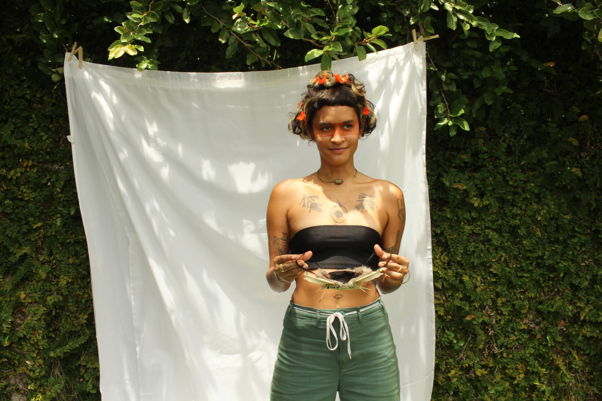

# About Me

My name is Kailey, but I prefer Kai and my pronouns are They / Them. I consider myself as a designer, puppeteer, agroecologist and multidisciplinary queer artist; anti-capitalist transfeminist defender of LGBTTIQ + rights. I am from a small island in the Caribbean called Puerto Rico, where I obtained a university degree in the studies of feminized bodies through design and performance. In my personal practice for some years now, I have done a lot of work with my hands such as sewing, ceramics, crafting with reused objects and farming. At this moment in time, I am very interested in the fact of growing our own food so that it is sustainable and accessible to everyone and the creation of our own materials through the reuse of organic "wastes".

