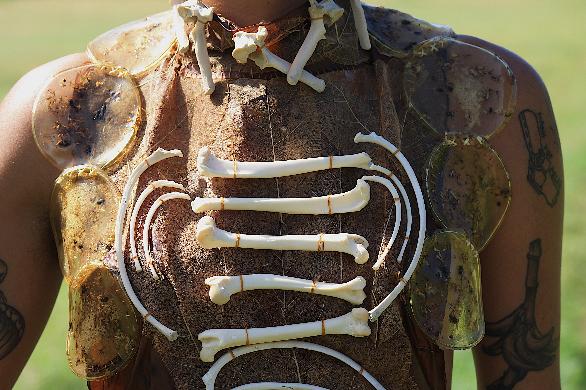
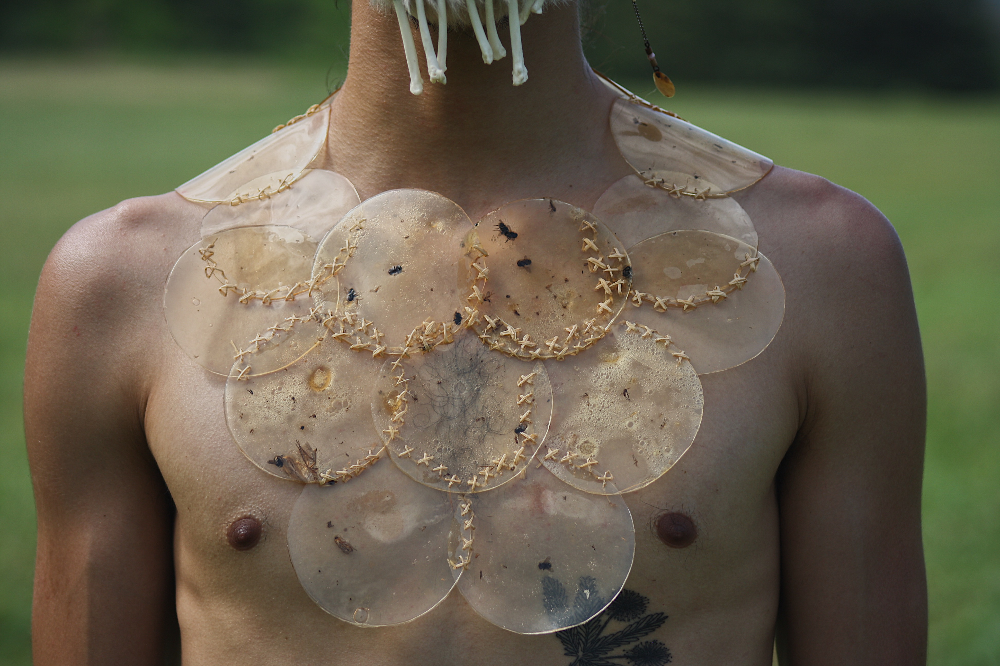
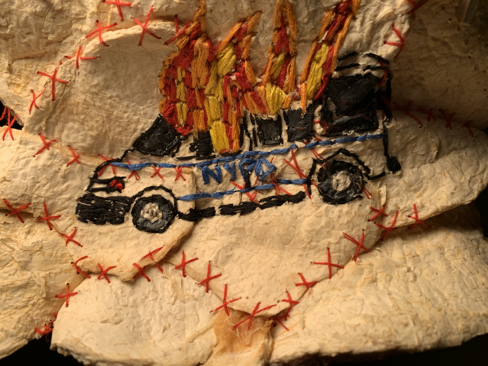
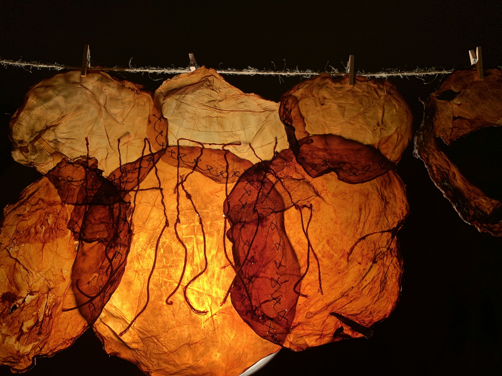

# About Me

My name is Kailey, but I prefer Kai and my pronouns are They / Them. I consider myself as a designer, puppeteer, agroecologist and multidisciplinary queer artist; anti-capitalist transfeminist defender of LGBTTIQ + rights. I am from a small island in the Caribbean called Puerto Rico, where I obtained a university degree in the studies of feminized bodies through design and performance. In my personal practice for some years now, I have done a lot of work with my hands such as sewing, ceramics, crafting with reused objects and farming. At this moment in time, I am very interested in the fact of growing our own food so that it is sustainable and accessible to everyone and the creation of our own materials through the reuse of organic "wastes".

Before, it is a series of clothing made entirely by hand with dog bones, dry leaves, biopolymers with insects and kombucha skin (scoby) w/ the purpose of rescuing and making visible ancestral traditions and/or customs within our context in "modernity" as a colony.
“Sustento” (the name of the project), tries to investigate and experiment sustainable alternatives in/with the material(s). In addition to seeking and / or creating sustainable interpersonal relationships, in a world that is on the brink of chaos and where more empathy, solidarity and love are needed.
In the same way, it rescues and makes visible ancestral knowledge, traditions and/or customs as a country from which these traditions were snatched thanks to the colonizations that have taken place since 1508, spanish & american.
Part of my artistic proposal and of my creative processes is to substitute and create materials that are sustainable and biodegradable, so that they can have a certain life time without doing more damage to the environment and ecosystems. As a result of this, they touch the political from environmental justice to making social injustices visible. Well, I am tired of the mess we have caused and I am looking forward to a green future, with less waste, with zero social injustice and a future accessible to all.

More works that I did back in Puerto Rico, about reusing wastes as a resource of textiles. On the 'ACAB' embroidery, I used dried orange peels and in 'Harta' I used scoby.
