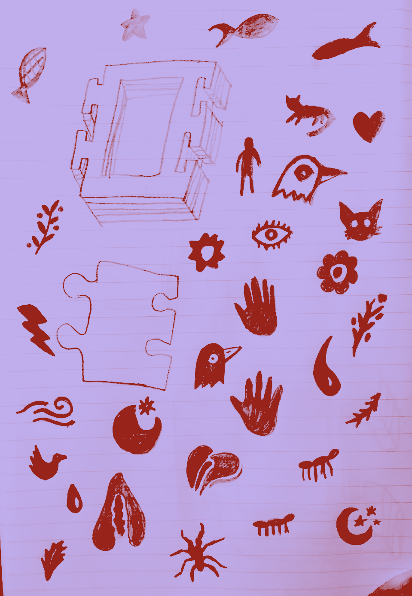
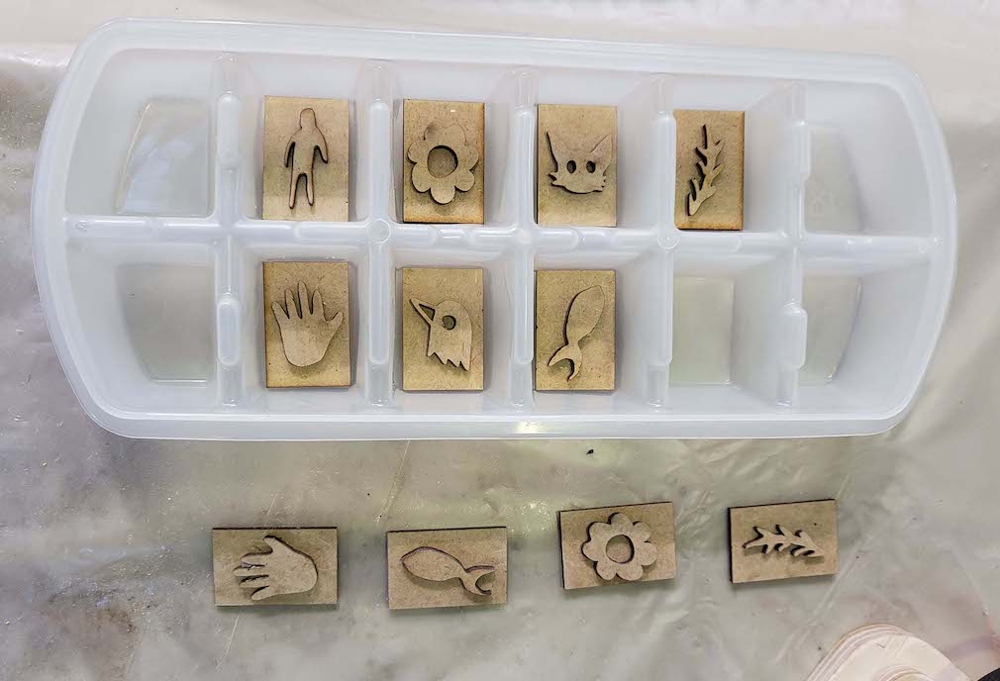
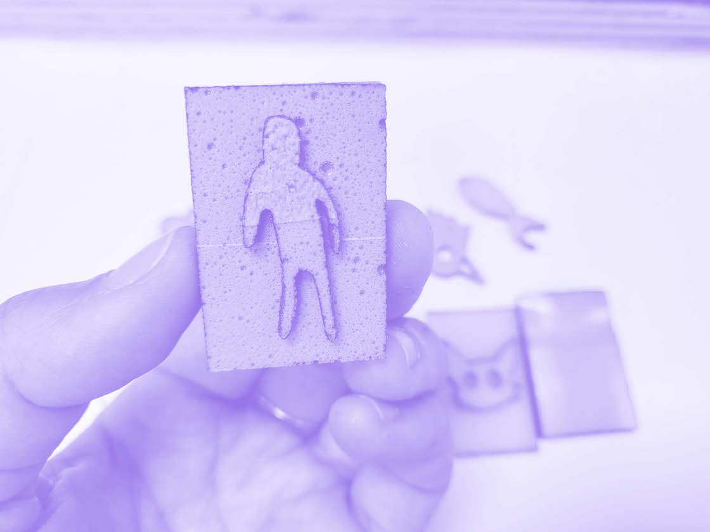
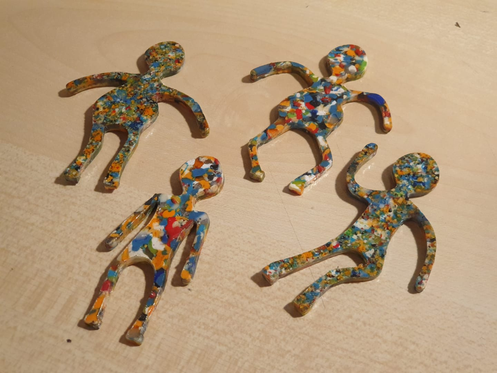

# W. 04 /Challenge- Biostamps

## IDEATION

*A stamp kit made made fully from waste/bio material for kids to construct and play with.*

The point was to test out different cutting and mold makingmaking techniques to realize the best results in terms of making successful stamps.

We are already executing our interventions together, and we are working in the areas of creative uses of waste, specifically in children’s toys and child play. We are currently working on building several toys made completely from waste and biodegradable materials in order to proceed with our interventions.

## PURPOSE

Our artifact is a collection of stamps with exchangeable handles that kids can use to make drawings our map out graphics. We went for a simple object and decided not to reinvent the wheel, but rather, question the way it’s made and challenge it.

## PLANNING AND EXECUTION

As we are already have common values and aligned interests, it was easy for us to pick something and go with it. We then proceeded in writing down all the steps required to reach our final result. You can find the list below, and a thorough breakdown of the instructions to replicate the stamps.

Overall, we had 4 main aspects to deal with: (1) design, (2) materials, (3) packaging, (4) finalizing + execution.

## DIAGRAM

Here is a diagram to explain the main components that make up the stamps.

## DESIGN PROCESS

The design process was focused on 3 main components:

## _1. Stamp drawing_

We drew the stamp as sketches in a notebook and later selected 7 designs. We then scanned and traced the designs on illustrator as vector drawings.

## _2. Handle design_

Same process as above, but a different design.

## _3. Stamp Base_

We had to think of the main shape of the stamp and the size of it, we also had to think of the way the different handles we designed can be replaced with each other by being attachable and removable from the stamp base.

## HONEST DESIGN

We mainly focused on the laser cut machine for this exercise, and how we can create molds (whether negative or positive) from different materials through the laser cutting technique. We had also employed the press to produce melted plastic sheets for the stamp base and the handles.

## MATERIAL SOLUTIONS

_FOR THE STAMP_

Our main goal was to make the stamp part out of biomaterials (Agar and vinegar based, so we followed two different approaches and we present both results.

  (1) The first process consists of using mdf to make our desired shape, then use silicone to create a mold, which we would later pour into the biomaterials and create our stamps.

  (2) The other process required making a flat sheet of biomaterials and then inserting it in the laser to directly cut our shapes and glue them together. We had interesting results.

  

  However, before the silicone we tried to use clay as our mold, in order to be as eco friendly as possible, however, when inserting the biomaterials, it mixed with the mold as the air dry clay is water soluble, and the biomaterials contained water.

_FOR THE STAMP BASE AND HANDLE_

We had to collect and find plastics that are from the same composition. Then, we had to shred the plastic with the shredder into little pieces, and then melt them in an oven on a horizontal stable sheet and wait for it the sheet to dry.

## DESIGN BOUNDARIES

We had to collect and find plastics that are from the same composition. Then, we had to shred the plastic with the shredder into little pieces, and then melt them in an oven on a horizontal stable sheet and wait for it the sheet to dry.


## FUTURE DEVELOPMENT

For the future, we firstly would like to follow a few recipes and learn how to make colored ink from natural ingredients.

We are also planning, as part of our design intervention, to take this kit to a kids’ park and see how they interact with it.

And finally, we hope to create a formula that is simplified, where we invite kids and their parents to “fab playdates” where we teach these kids and their parents how to easily create these stamps from wastes at home. These playdates would orbit around our common values which revolve around materials’ second life and viewing waste as a resource, but most importantly, demonstrating to the young generations how they can be active agents and create their environment rather than just be consumers.

# REPLICABILITY
_Level of clarity and detail of the documentation material (photos, videos, text, etc)_

## FABRICATION AND MATERIALS

## Materials:

Feroca, Silicona de platino (easy plat) we used to do the molds in silicone.

## Mold Method:

- Molds of the shapes/bases:
In the laser cutter machine, we ‘cut’ the shapes of the drawings of our stamps apart form the rectangle bases and after they were cutted, we glue them together.

_1. Without the rectangle base in silicone:_

- We used the wood stamps w/ an ice cube plastic tray to do a silicone mold.

* We mixed in equal parts, 1:1

* We measured the volume of the spaces in the ice cube plastic tray that we were going to pour the mixture 1:1 of the silicone.

* Took the time to clean the tray and put the wood stamps at the bottom facing up.

* Then, divided the recipe of the silicone total in two; one for part A and one for part B (catalyzer).

* We joined the catalyzer in part A bowl & mixed it well for 10 min. to 12min, being careful not to create bubbles.

* After mixing well, we pour the mix on the spaces of the ice cube plastic tray.

* We it solidify for three-four hours.

* And finally, we took the mold that we did in silicone, out of the ice cube tray.

_2. With the rectangle base in silicone:*_

- We used some square molds made of wood that Lara had left us when we did the remixing materials workshop, covered them up with plastic and tape so that the material we wanted to pour on them did not leak out of the mold.

- After it, we taped the wood stamps that we did in the laser cutter and tapped them into the wooden part used as support.

- Mixed the 1:1 silicone recipe & pour it into the molde we made.

- Let it rest for 3-4 hours and then took it out of the mold.

- By putting the wooden stamp on the wooden mold, it created a type of "staircase" in which the silicone mixture was covering each step because it was on a flat surface. That is why the mold was created rectangular with embossing on the drawing shape part.

_3. With the rectangle base in air-dry clay:_

- We used the wooden stamps that we laser cutted and we made an impression, compacting the stamp on the piece of clay.

- We let it dry for a couple of hours.

## Biomaterial Recipe:

- 200ml. - Water - We used as an additive for the pigmentation of the material, seeds of annatto (boiled in water and a drop of oil, before).
- 10grs. - Agar Agar
- 2ml. - Vinegar
- 2grs. - Glicerine

## Shapes in Biomaterial:

*Alternative 01:*
Using the mold that we did in clay, it formed the shape with the drawing united with the base. We pour the biomaterial in it and let it dry for a couple of minutes.

After it, we tried to take the material out of the clay mold but it did not work. We assumed that is because the clay absorbs water and it was like it didn’t dry completely; even though that we let them there for two more hours and it was the same when we tried to took them out.

*Alternative 02:*
When we cutted the drawing shapes, we did a rectangle around them in order to take that negative piece out of the rest of the scraps & reuse it as a mold to pour biomaterials.

We placed the negative wood piece of the shapes on top of wax paper and cover each of the sides with tape so that the material does not leak into the table that we used as support.

After organizing our space, we cooked the biomaterial specified before & pouring it in our mold.
Waited a few minutes until the biomaterial of Agar Agar was dry enough to remove from the wood mold.
Took the material out w/ a fine ceramic utensil passing it around the edges so as not to break the material.

*Alternative 03:*
Using the mold of the ice cubes shapes that we did in silicone and w/ the same recipe of biomaterial we pour the mix on each one of the silicone ice cube.

We let them dry for 5 minutes and took them out of the mold, having the just the shape as result.

*Alternative 04:*
Using the mold that we did in the square wood mold of Lara’s workshop, we pour the biomaterial recipe wrote before & let the material dry for 5 minutes resulting in the shape of the engraved drawing united with the base in the form of a rectangle.

*Alternative 05:*
We used dried biomaterials made from agar agar in the fab lab before and pu ti in the machine to see if it worked working the design of our stamps. We cut them separately and then glue them together in order to have the drawing of the stamp and the base.

## Files

[ADD LINK] design and fabrication files (open source or open format)

## Designs

The design of the persons as an object that is used to hold the base of the stamp and to put the fingers in order for it to press and stamp, was made by Kai.

Particularly they did the design for a Fab Academy course assignment that involved making a parametric design and Kai decided to make a carousel of people. We took the design with a view to reusing materials that we had on hand, and also because it is child friendly and cute.

As we intended to reuse materials in the classroom or Iaac, in the last workshop of Remixing materials, different groups made a research of wastes and created biomaterials based on what they researched. Dídac, Anna & Jeremy did research of the wastes that Iaac 3D printers were having and created sheets of melted plastics. We talked with them to see if they were going to use the sheets to do something and they told us that not all of them.

So we send the person’s file that Kai created on illustrator and George adjusted the measurements and created the bases to fit them to Dídac and he helped us on laser cutting them.

The designs of the drawings for the stamps, were made by hand by George. We took a picture of them downloaded and edited them on illustrator; we laser cut them in various materials such as agar agar and soap biomaterial sample made by Fab Lab, wood, and we did them too in biomaterials made by us from agar agar wit and without annato.

## BOM (bill of materials)

*Silicone*
*Mdf - Wood* 
*Cardboard*
*Biomaterials: Agar Agar, Vinegar, annatto, water*
*Agar Agar & sopa biomaterial (made by fab lab)*

## Problems

* We did our first mold he mold in clay, it formed the shape with the drawing united with the base. We pour the biomaterial in it and let it dry for a couple of minutes.
After it, we tried to take the material out of the clay mold but it did not work. We assumed that is because the clay absorbs water and it was like it didn’t dry completely; even though that we let them there for two more hours and it was the same when we tried to took them out.

Anticipating the possible problems that this could cause us, we decided different methods of how to get the stamps of different molds. So we experimented with creating two different molds in silicone and using the negative pieces of the laser cut machine as a mold. And all of them worked.

* We cutted samples of agar agar biomaterial made in fab lab in the laser cut but some of them did not cut well or melted too much. So, we think that we need to test more samples of biomaterials in different properties on the laser cut that can lead us to a better cut of the material without it melting so much and cutting well. It helped us a lot, that we cutted three sheet of agar agar from fab lab and that we had a lot of biomaterial made out of different molds so as not to fall short.

## Final Product

