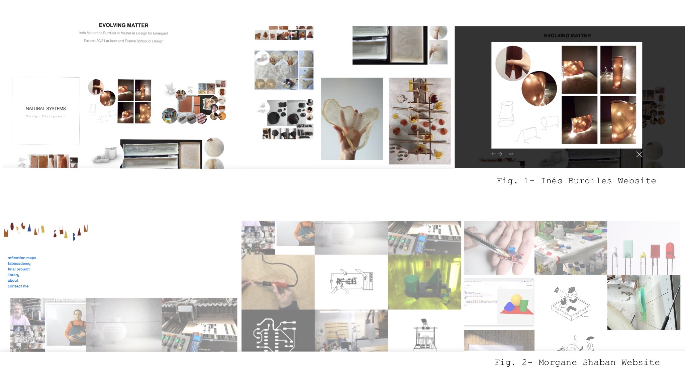

# Week .01

The first Fab challenge was about 3D CAD; Blender as software to sculpt being free & open-source. I have never used this softwares, except last trimester that Dídac & I joined to do a puppet head in 3D, I downloaded a program called Nomad at my Ipad and sculpt a model (fig. 4) that later we used to do the head. Now that they are teaching it, makes me more interested in using this kind of softwares to sculpt digitallly.

 As for the references of past students websites, I chose Inés Burdiles (fig. 1) & Morgane Shaban (fig.2) websites, they interested me the most for the simple and colorful of their pages. I would like to change my webpage and put them drawingss of mine, as Morgane's page and take good pictures so that my projects can be shown is jut one picture as Inés page.

 I want to try using elements of their compositions, style and features in my page. Put photos and/or  them titles that direct people into de project description.

The second lab challenge was to do a model in blender. As I wrote before, I had made a model for last trimester in order to do a negative puppet head and pour biomaterials recepies to create degredables toys. So my first try of using this kind of softwares for sculpting was figure 3. Figure 4 is the final model of the puppet head that I did on Nomad.

