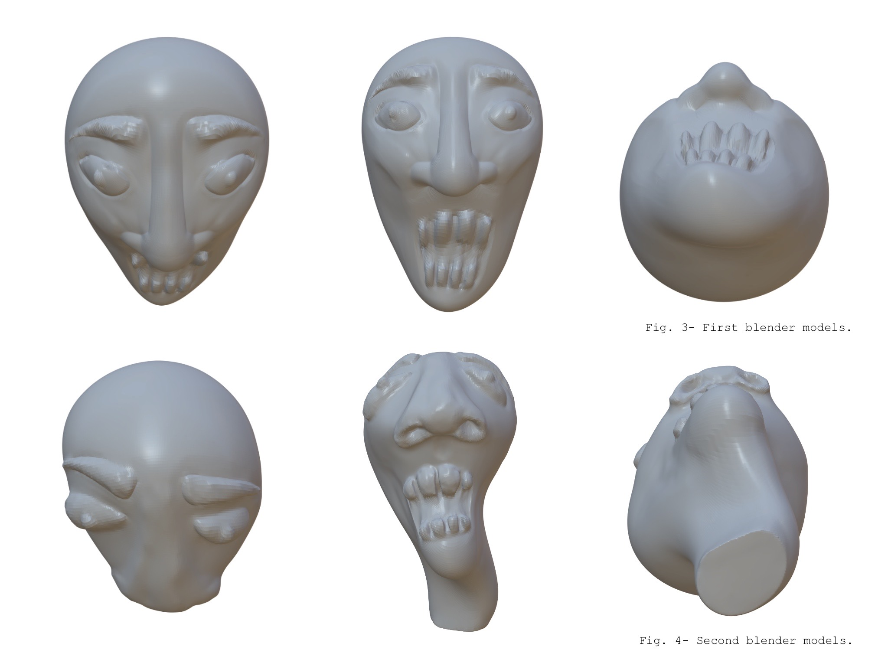

# Week .02
**February 2**
## Blender Model(s)
The second lab challenge was to do a model in blender. As I wrote in week 1, I had made a model for last trimester in order to do a negative puppet head and pour biomaterials recepies to create degredables toys. So my first try of using this kind of softwares for sculpting was figure 3. Figure 4 is the final model of the puppet head that I did on Nomad.

