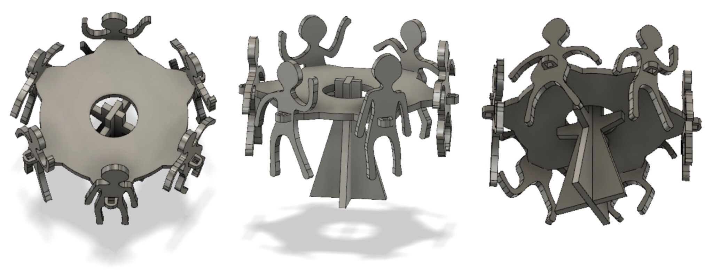
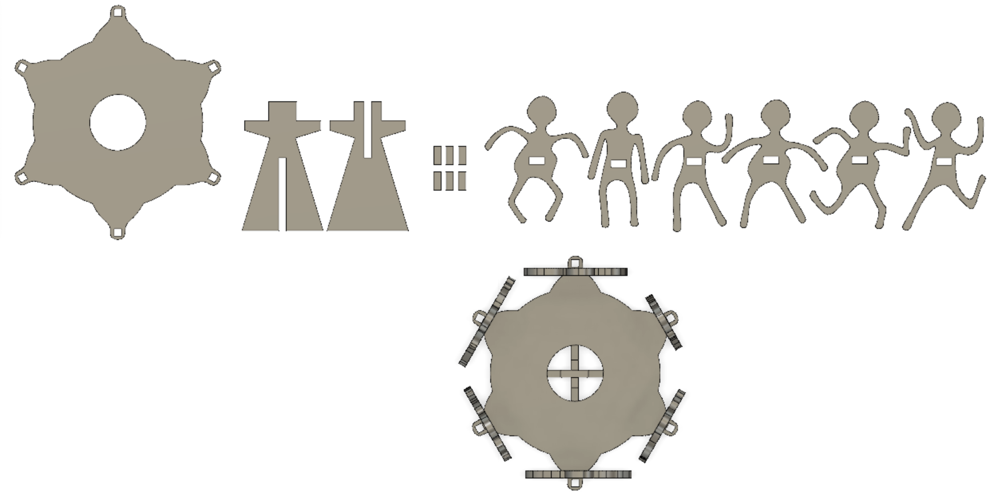

# W/ .03

**February 7 / 11**

This week Guiseppe & Santi showed us the history of the Laser & vinyl cutter and how does they work. The different types of materials that can be cutted in the laser, such as wood, acrylic, cardboard, non-toxic leather, etc. an it's power, speed & frequency.
Meaning that if you adjust the following parameters, it will determine the depth to which the laser will cut:
Power: the percentage of power used by the laser.
Speed: the speed at which the laser carriage moves throught its job.
PPI (Frequency): The firing rate of the laser as it moves (pulse per inch).

Raster, Engraving & Cutting, the work that the laser can do. Raster is like making and image without deepening the line; engraving, is deepening the line without cutting it; & finally, cutting.

Just using the black color to raster and for cutting you need to cut the inner part first and then you cut the outter part of the design. Format; vector/raster

## Assignment:
Create a parametric desgin like a box or something & use the laser cutter for it.

For this task I decided to make it easier for me because I don't know how to use any 3D softwares. I used Fusion 360 because Rhino is not a free software and it's not cheap either (haha). So, first I did the 2D design in Illustrator to make it easier for me and then coverted that document in dxf and and I opened it in fusion. Made a human carrusel. <3

