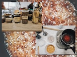

# Design Studio.01

## Materials 

Having a conversation with one of my colleagues (Ruben), we came to the conclusion that we wanted to work with the same thing, agriculture. But what about it in particular is or was that we did not know. He told me that he wanted to make a concept map to see if he could get something from it and that idea make me to do the same exercise but at home, including my two roommates/friends. To give a bit of context, my two roommates are from Puerto Rico, just like me. In addition to that, one of them is studying Agroecology and the other, Studies of women and gender at the Faculty of Geography but with knowledge in feminist ecology, both at the University of Barcelona. Therefore, what better help than three minds and bodies that come from the same context, from a small island in the Caribbean that is still a colony of the United States and that are studying things related?

This is our concept map in the house, about things that revolve around the word "Agriculture".

 

## 01 Design Studio Experiment with Biomaterial puppets

As a puppeteer, I see importance in the development of toys for children and in my personal practice, I use recycled materials, whether organic, plastics, etc. to include any type of person with or without crafting / art skills. With this, I prioritize creating them at home with the things we have, to reduce expenses and material consumption.

When we went to Collserola Natural Park to hike, while we were going down, I realized the amount of children's toys that had been discarded without having previously thought about the possibility of recycling and transforming them or making exchanges among other children or giving them to organizations that collect them or others.
So, keeping in mind my recycling practices, that even though I reused materials if I discarded it, there would also be a possibility that it would end up in the same place where these toys ended up. I don't want a toy of mine to end up causing more damage just by crafting it. How can I end the life of my toy without doing more damage to the earth?
Makinf it with Biomaterials.

This is the second prototype of the head of a puppet in 3D digital modeling. The fisrt one, was in clay that dries with the air.

## 02 Workshops Experiments

 - Biomaterials - Biopolimers 

I have been taking different workshops with individuals outside Iaac, to keep investigating & experimenting alternatives materials. This workshop was imparted by Lara Campos, a collaborator with fablab Barcelona on a proyect called "Remix el Barrio".

This biomaterial was made with pine resin and carnauba wax.
I made different samples to see how dyes, organic material and molds reacted to the biomaterial. I used lavander, spirulina dye, oxide, hibiscus flower in alcohol, egg shells and many others to do different testings & this were some of the results.

- 002 Biohilos

As a second try of experiments, I did some Biohilos with an argentinian person called Carolina Etchevers. We used sodium alginate, calcium chloride and water to make them. It was a very interesting elaboration & would love to keep experimenting with it to see what it can be done. <3 

