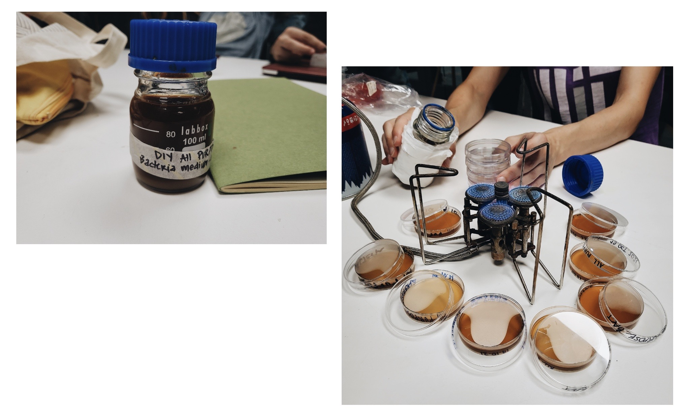
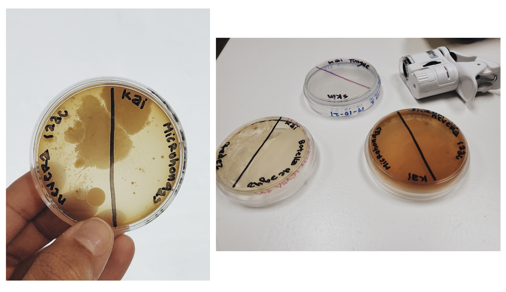
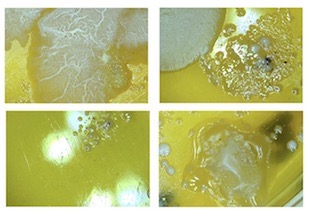
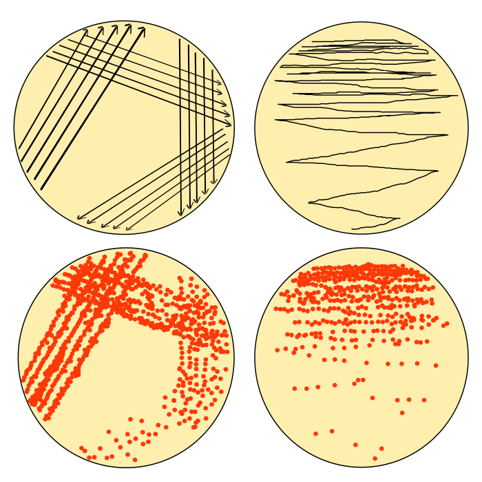
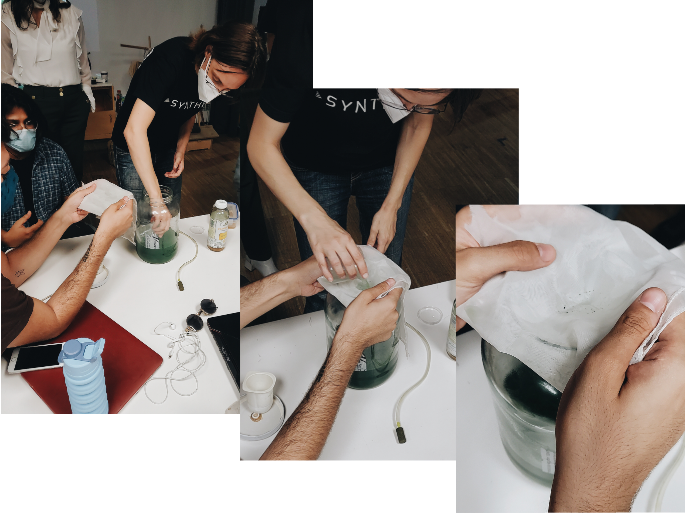

# Bio-Zero

This week was very interesting by the way we entered different branches in general science. Exciting to be able to grow micro-organisms from things we found. It felt like a very long seminar because of all the information that Jonathan and Nuria gave to us. It was too, because every day, they talked about a different topic so it was a bit exhausting. But, I think that with help of this seminar, I am interested in continue explorations regarding biology.

## iGEM Experiment

- Purpose:

To create a bioengineer microbes on a strip where you put a drop of tattoo ink and could tell you if the ink is contaminated or if it’s ok to be used.

- How?

Non-selective Agar Medium strip to detect Aerobic Mesophilic Bacteria 

I search online about how to detect  aerobic mesophilic bacteria and got to the tests of bacterias in cosmetics. What they perform is a test by diluting in a neutralized solution, at the same time the product is subjected to an enrichment culture to facilitate growth of some bacteria that may be represented in a low number. Dilutions of the product in neutralizing solution and enrichment culture is plate on solid non-selective agar medium (Non-selective media are intended to cultivate microorganisms in order to multiply them. It is a simple culture medium without a selection agent that will allow the growth of microorganisms in an undifferentiated way) and incubated for 72 hours at 32.5ºC.

“The most common growth media nutrient broths (liquid nutrient medium) or LB medium (Lysogeny Broth) are liquid. These are often mixed with agar and poured into Petri dishes to solidify. These agar plates provide a solid medium on which microbes may be cultured. They remain solid, as very few bacteria are able to decompose agar. Many microbes can also be grown in liquid cultures comprised of liquid nutrient media without agar”.

## Spirulina & Kombucha Cultivation 

Growing spirulina and kombucha were the two things that most motivated and captivated me. It is not my first time working with kombucha, as I have become scoby mother for a while now. But, to return to the concept of cultivating it with others, I really liked it. Furthermore, I had never grown Spirulina before and neither did I know that it was used as food.
I like cultivating kombucha to create leather after its process of growing. You can do a lot of stuff with it, that its a genius organic resource. As equal as Spirulina, you can use it for food, for your health or even though for organic dyes.
We used microspcopes to see the bacterias that we cultivated by recollecting things inside or outside Iaac. It was ver stressful to see that stuff you commonly use, are highly contaminated with bacterias.
After this, we got assigned to look for things outside Iaac to see them under a microscope and it was very fun. I carried a dead hundred foot insect that I had killed the day before and seeing its textures and colors with a microscope was fascinating and scary at the same time.

## Science paper

Title: Biodegradation of bioplastics in natural environments

Excessive production of petroleum-based plastics demands sustainable alternatives from renewable resources; 34 million tons of plastic wastes are generated each year throughout the world and 93% of them are disposed of in landfills and oceans. Thus, in order to create a sustainable environment and prevent the possible disposal of recalcitrant plastic wastes in the environment, production of bioplastics gained a lot of attention due to their biodegradability. Actually, the word bioplastic can refer either to bio-based plastics synthesized from biomass and renewable resources such as Poly(lactic acid) (PLA) and Polyhydroxyalkanoate (PHA) or plastics produced from fossil fuel including aliphatic plastics like Polybutylene succinate (PBS), which can also be utilized as a substrate by microorganisms.

- In 2014, 1.7 million tons of bioplastics were produced through- out the world. The production of bioplastics is expected to reach 6.2 million tons in 2018. In 2012, PLA and starch-based were the most utilized bioplastics by 47 and 41% of total consumption, respectively. Moreover, Polyhydroxybutyrate (PHB) bioplastics got the attention of the scientific community due to their low CO2 emission. 
- Although bioplastics are considered to be environmental friendly materials, they also have some limitations such as high production cost and poor mechanical properties. High production cost drawback can be managed by utilizing the low cost of renewable resources such as agricultural wastes. Among the bio-based plastics, Poly(lactic acid) (PLA) reveals optimum properties including high tensile strength and modulus. Poly (hydroxyalkonates) (PHAs) are their commercial competitors although they lack some optical and mechanical properties when compared to PLAs. 
The biodegradation of polymers consists of three important steps: (1) Biodeterioration, which is the modification of mechanical, chemical, and physical properties of the polymer due to the growth of microorganisms on or inside the surface of the polymers. (2) Biofragmentation, which is the conversion of polymers to oligomers and monomers by the action of microorganisms and (3) Assimilation where microorganisms are supplied by necessary carbon, energy and nutrient sources from the fragmentation of polymers and convert carbon of plastic to CO2, water and biomass. 
A huge amount of plastic wastes is disposed of in landfills which eventually leads to generation of greenhouse gases and leachate. 
Compostable plastic is "a plastic that undergoes degradation by biological processes during composting to yield carbon dioxide, water, inorganic compounds, and biomass at a rate consistent with other known compostable materials and leaves no visually distinguishable or toxic residues” 
- Compostable plastic is biodegradable whereas a biodegradable plastic is not always compostable.
Studying the biodegradation of PLA bioplastic under home composting conditions during 11 months showed a very slow biodegradation. This could be attributed to the lower temperature than that of the industrial scale trial which could be performed at a higher temperature range (Thermophilic). 
[https://www.sciencedirect.com/science/article/abs/pii/S0956053X1630561X](https://www.sciencedirect.com/science/article/abs/pii/S0956053X1630561X)

## References:

Dieckmann, R. (2016, 7 octubre). The Risk of Bacterial Infection After Tattooing. NCBI. [https://www.ncbi.nlm.nih.gov/pmc/articles/PMC5290255/](https://www.ncbi.nlm.nih.gov/pmc/articles/PMC5290255/)

User, S. (s. f.). Cosmetics testing - Microbiology of cosmetics. Detection and counting of aerobic mesophilic bacteria (UNE-EN ISO 21149: 2017). Accredited by ENAC. IVAMI. [https://www.ivami.com/en/microbiology-of-cosmetics-laboratory-of-control-authorized-by-aemps-8-accredited-tests/3353-ca-cosmetics-testing-microbiology-of-cosmetics-b-detection-and-counting-of-aerobic-mesophilic-bacteria-b-une-en-iso-21149-2017-b-accredited-by-enac-b](https://www.ivami.com/en/microbiology-of-cosmetics-laboratory-of-control-authorized-by-aemps-8-accredited-tests/3353-ca-cosmetics-testing-microbiology-of-cosmetics-b-detection-and-counting-of-aerobic-mesophilic-bacteria-b-une-en-iso-21149-2017-b-accredited-by-enac-b)

