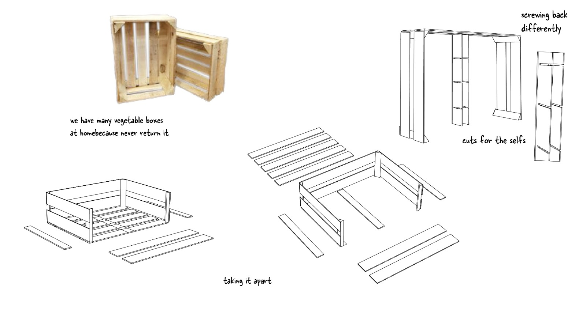
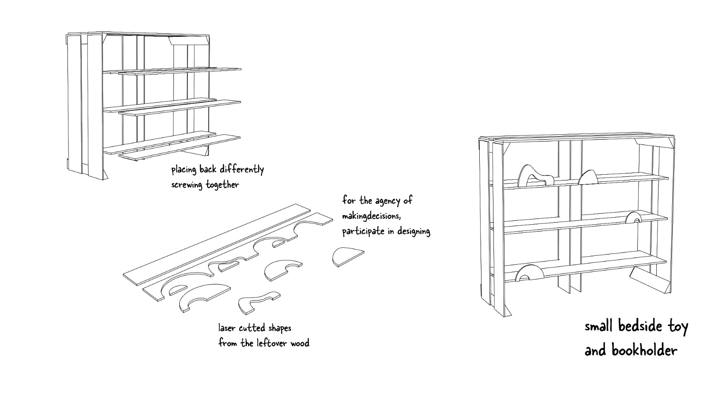
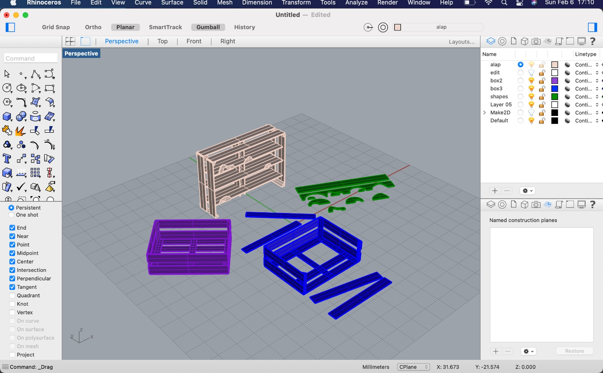
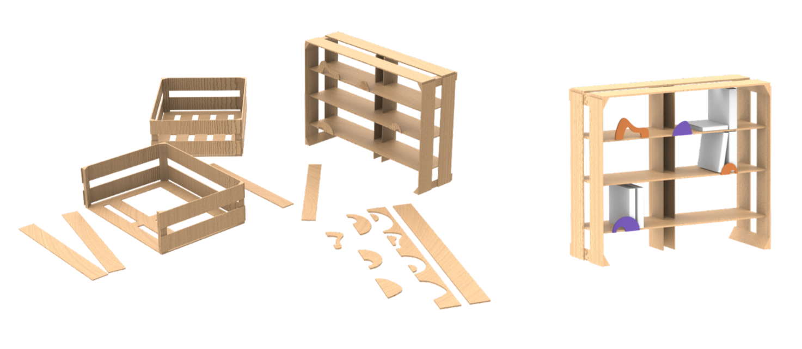

# Design Studio .02

This trimester I decided to keep exploring on doing toys made out of biomaterials, trash and other materials for the next intervention. But this time, instead of just only Anna & me, Borka & George joined us to build and work different ideas of building toys with this materials & applying tech to it.

At first Anna designed some toys based on the materials they found on the streets of Pobleonu last thursday, february 3rd 2022. This was because some of us in the master, had this thing in mind on rescuing things that people throw out & use them as materials for building stuff such as furniture, toys, planters, etc.

This designs were made by Anna:

<video src= "../../images/IMG_7717.MOV" width="520" height="440" controls></video>
Another game board made of trash found at the streets:

Then Borka had an idea of creating a small bedside toy & bookholder made of a lot of vegetable boxes that she has from a shop that doesn't reuse them. So, dismantling the boxes so they can be place differently & creating laser cutted shapes using the leftover wood as shadow figures on the wall. It too can be possible, as I talked to Borka, of implementing biomaterials made from the molds of the wood that were cutted by the laser cut and create a shadow play for them.

Here our first Presentation of the process of building "Wasteful Playfulness":
[https://docs.google.com/presentation/d/1bWtHorgM7NAvP15Tmx_u32Du2owxhI0ERu7t-ZK8JNc/edit?usp=sharing](https://docs.google.com/presentation/d/1bWtHorgM7NAvP15Tmx_u32Du2owxhI0ERu7t-ZK8JNc/edit?usp=sharing)
