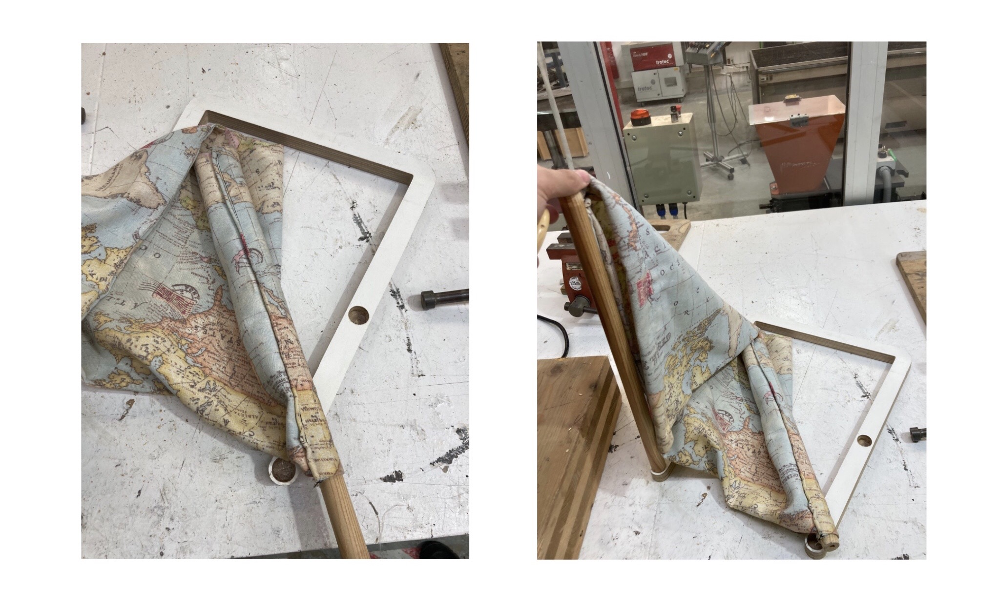
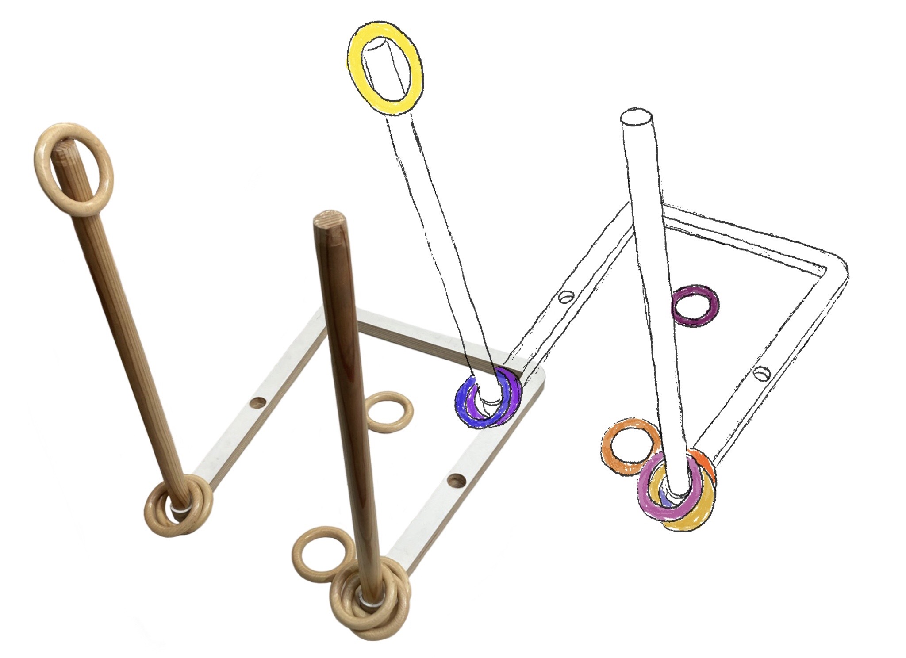
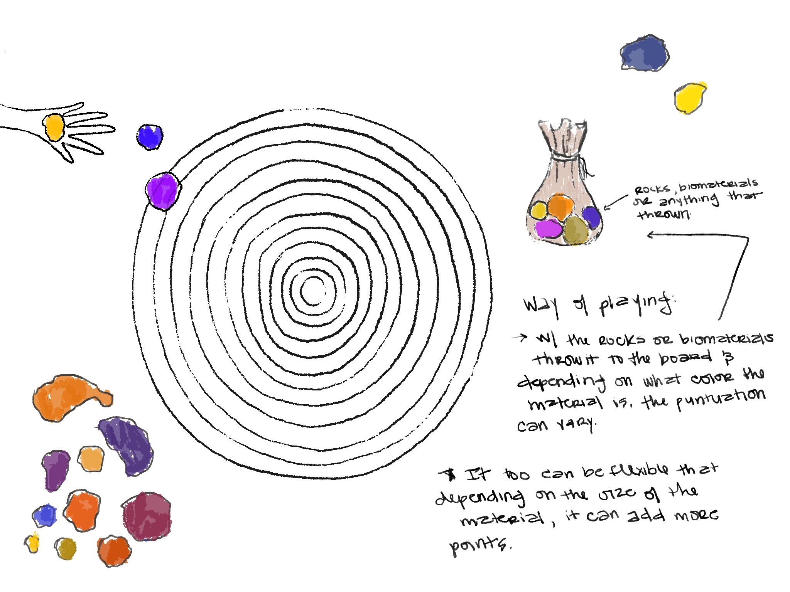
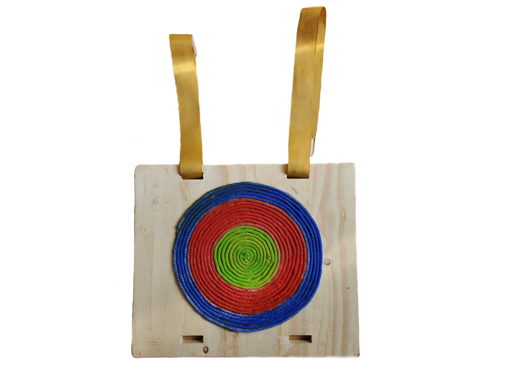

# Design Studio .02

This trimester I decided to keep exploring on doing toys made out of biomaterials, trash and other materials for the next intervention. But this time, instead of just only Anna & me, Borka & George joined us to build and work different ideas of building toys with this materials & applying tech to it.

At first Anna designed some toys based on the materials they found on the streets of Pobleonu last thursday, february 3rd 2022. This was because some of us in the master, had this thing in mind on rescuing things that people throw out & use them as materials for building stuff such as furniture, toys, planters, etc.

This designs were made by Anna:

Another game board made of trash found at the streets:

Here our first Presentation of the process of building "Wasteful Playfulness":
[https://docs.google.com/presentation/d/1bWtHorgM7NAvP15Tmx_u32Du2owxhI0ERu7t-ZK8JNc/edit?usp=sharing](https://docs.google.com/presentation/d/1bWtHorgM7NAvP15Tmx_u32Du2owxhI0ERu7t-ZK8JNc/edit?usp=sharing)
