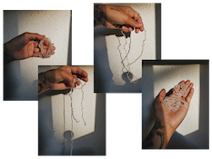

# Remixing Materials w/ Lara Campos

As exploratory material, I have decided to opt for creating bio-threads. For two years now, I have immersed myself in the world of research into materials based on organic waste. Bio-threads as such can be created with sodium alginate and calcium chloride, together with water. Pigments or other waste can be added to help its formation. I had never tried to create bio-threads before, since last December I participated in a workshop with an Argentine researcher named Carolina Etchevers. After this workshop, my interest in continuing to explore biothreads intensified and now I would like to continue exploring them.

Lara has a project called 'Be Grounded' that she did for Fabriacademy in 2019 where she knitted seeds into yarn filaments. That made me wonder if it would be possible to create natural-based threads that could grow food plants to be able to create street sculptures and occupy public spaces to be able to cultivate. Below, my first try of making bio-threads.
Here some of Lara's work:

And Carolina Etchevers work:

This are more experimentations w/ bio-threads but in this case as part of Lara Campos biomaterials class & group experimentation.

Part of how could I imagine this kind of sculptures is based on Robert Cannon's work 'Terraform' 2010. 

But, this sculptures are very sophisticated more than what I'm looking for. Actually, I wish I could try to create earthen structures where the bio-threads could get tangled up and plants could grow. I am not looking for these sculptures to fall into the aesthetic, on the contrary, I seek to produce accessible food for everyone with them.
We could use chicken wire or even go completely organic and use natural straws to form the structure of whatever we want our food sculpture to be. In addition to that, materials such as compost and soil, such as seeds, are necessary for this type of intervention to be carried out.
Also, instead of creating living sculptures, living garments could be created just like Lara did. But considering that these garments, after their useful life, are completely degradable since they will be created with biothreads and seeds.

Here the recipe:
12,5 grs. alginate 
500 ml. water
30 ml. glycerin additives
Calcium chloride solution: 30 grs. CaCl / 500 ml. H2O