# Remixing Materials .01
## W/ Lara Campos

This week we started a biomaterial workshop w/ Lara Campos. Lara has worked before in Remixing Material together w/ Fabriacademy BCN. 
Here some of Lara's work:

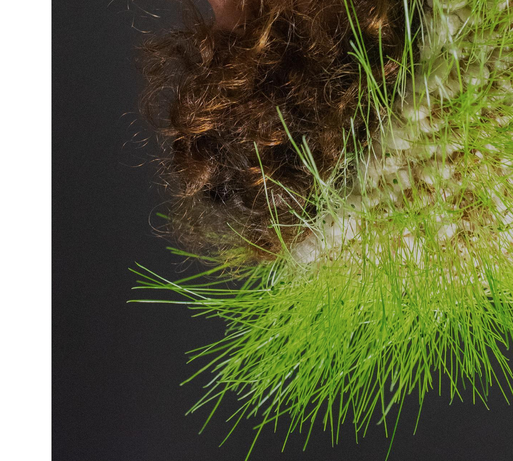
In this workshop, we learned about the origin of the materials we used in the workshop such as agar agar, gelatin, wax, resine, alginate and chloride.
We did samples in the class w/ all the materials mentioned before, to see the different properties of each material after it dried.
Lara told us to explore w/ the materials that we tried in the class, to keep exploring the possibilities of each.
As exploratory material, I have decided to opt for creating bio-threads. For two years now, I have immersed myself in the world of research into materials based on organic waste. Bio-threads as such can be created with sodium alginate and calcium chloride, together with water. Pigments or other waste can be added to help its formation. I had never tried to create bio-threads before, since last December I participated in a workshop with an Argentine researcher named Carolina Etchevers. After this workshop, my interest in continuing to explore biothreads intensified and now I would like to continue exploring them.

Carolina Etchevers work, the argentine researcher:
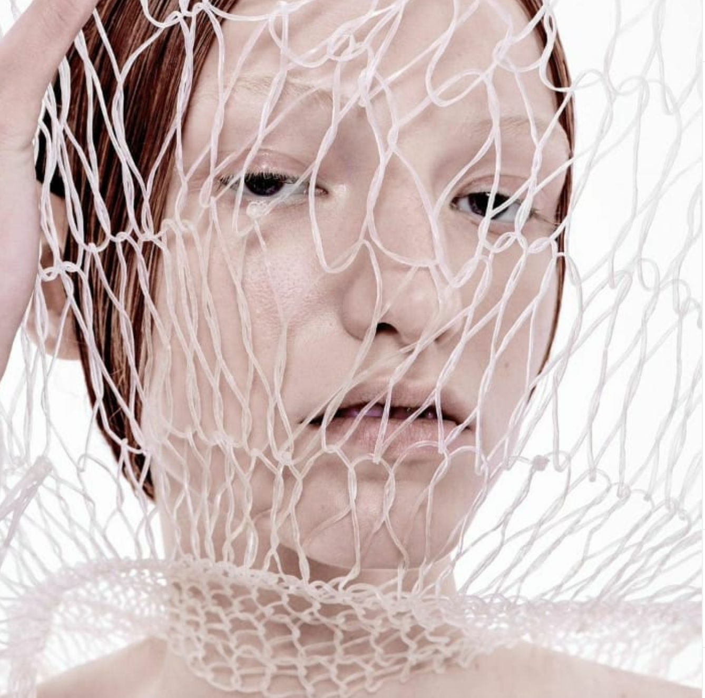

For the biothreads I used this recipe in order just to keep exploring the forms and how they dry instead of adding other materials such as waste.

- 12,5 grs. alginate

- 500 ml. water

- 30 ml. glycerin additives

- Calcium chloride solution: 30 grs. CaCl / 500 ml. H2O

Process:

1. choose ingredients 

2. grind additives

3. weight & write quantities 

4. prepare frame with fabric

5. mix ingredients

6. spray calcium chloride solution on fabric

7. pour mix

8. spray calcium chloride to solidify 9. let it dry

10. remove from frame

This are more experimentations w/ bio-threads but in this case as part of Lara Campos biomaterials class & group experimentation.
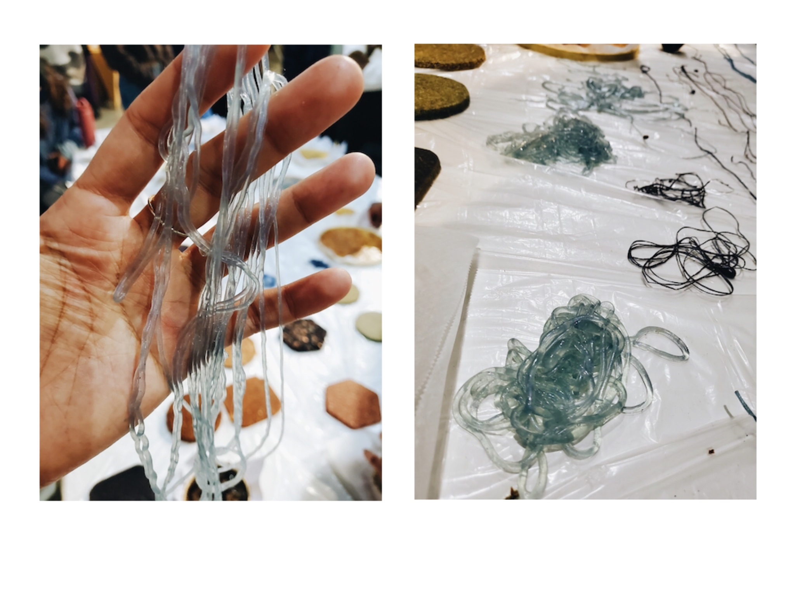

I did too some samples w/ agar agar & egg shells, for me to use the waste of my house and explore its properties. And for the Agar Agar recipe, I used was:

- Agar agar: 10 grs.

- Water: 200 ml

- Vinegar: 2 grs.

- Glicerine: 2 ml.

- Egg shells: 41 grs.

Process:
1. select ingredients

2. weight & write quantities

3. prepare frame with fabric

4. pour water slowly into powder (biopolymer)

6. cook at mid fire 10/15 mins or till boiling point and turn it down add plasticizer (glycerin/oil) & antibacterial (vinegar or essential oil)

7. add additives

8. pour in frame

9. leave it dry completely (to avoid shrinkage)

10. remove from frame

The egg shells are almost entirely made of calcium carbonate. The shell also has a thin outermost coating called the bloom or cuticle that helps keep out bacteria and dust.
For me, I chose to work w/ egg shells because we cooked them a lot in my house so it is a waste that is constant. But, it too works as fertilizer for plants and for unclogging drains, so if they decomposed they could be usefull. Agar Agar is a renewable resource derived from red macro algae and it is local since you can localize them in spanish coasts. Works as a fertilizer, it is compostable & it's industrial use: gastronomy, medicine, farmaceutic.
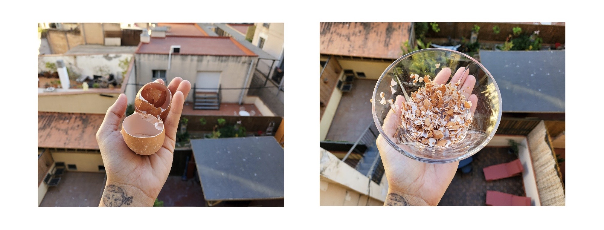
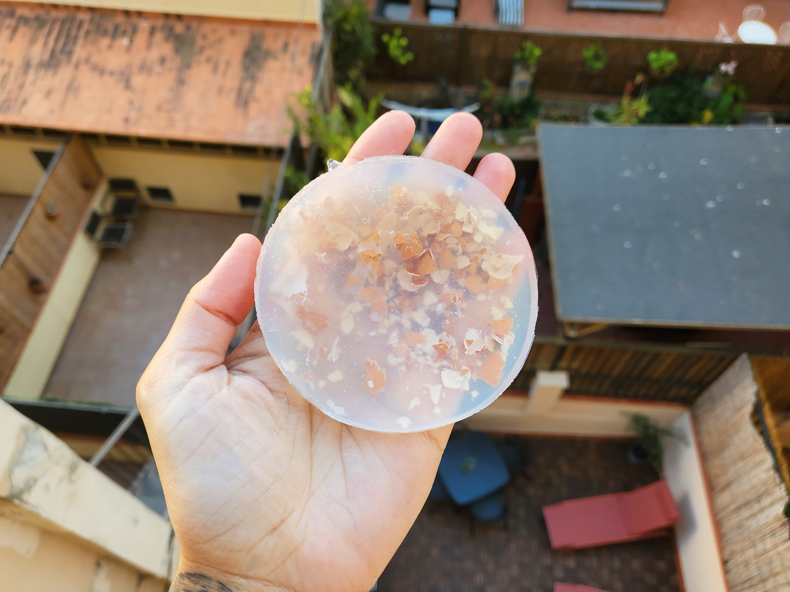

After this workshop, I wanted to create living sculptures or garments that germinate food. Lara has a project called 'Be Grounded' that she did for Fabriacademy in 2019 where she knitted seeds into yarn filaments. That made me wonder if one of possibles uses can be to create natural-based threads that could grow food plants to be able to create street sculptures and occupy public spaces to be able to cultivate. Below, my first try of making bio-threads. Part of how could I imagine this kind of sculptures is based on Robert Cannon's work 'Terraform' 2010. 

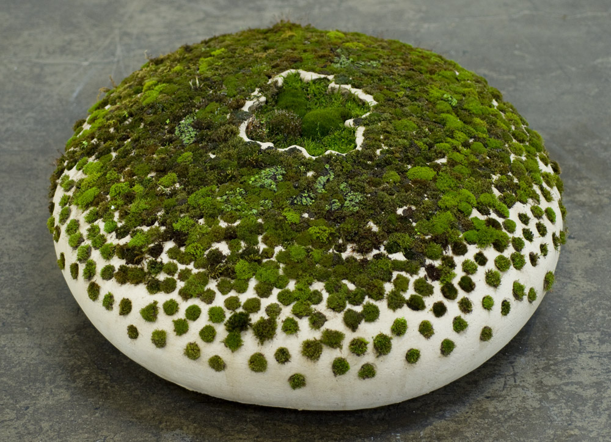
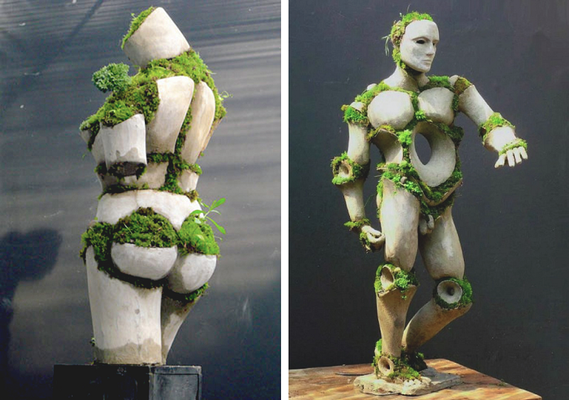
But, this sculptures are very sophisticated more than what I'm looking for. Actually, I wish I could try to create earthen structures where the bio-threads could get tangled up and plants could grow. I am not looking for these sculptures to fall into the aesthetic, on the contrary, I seek to produce accessible food for everyone with them.
We could use chicken wire or even go completely organic and use natural straws to form the structure of whatever we want our food sculpture to be. In addition to that, materials such as compost and soil, such as seeds, are necessary for this type of intervention to be carried out.
Also, instead of creating living sculptures, living garments could be created just like Lara did. But considering that these garments, after their useful life, are completely degradable since they will be created with biothreads and seeds.

Also, other uses can be creatign garments w/ this biomaterials or decomposables bags, or pots, soaps and many other things. In this case, my samples of theads can be use to create bio-based fibers and textiles in a way to substitute textiles that take to much time to degrade and/or are very toxic to our environment. This replacing textiles use in fashion, decorations, furniture, etc.

As for my samples in agar, I have to change the recipe in order for it to be hard and does not break quickly.

## W/ Laura Freixas

Laura Freixas gave us her workshop dedicated to data collection regarding the materials/waste that we were going to create. Know its origin, its usefulness, the reason for its waste, its properties, the application that we would give it and the recipes that we made
It also introduced us to look for waste near our Iaac community, such as restaurants, bakeries, workshops, among many others that daily discard material.
We did our reserch w/ some documents Laura shared to us, for it to be more fast and have in mind the data that we recollected.
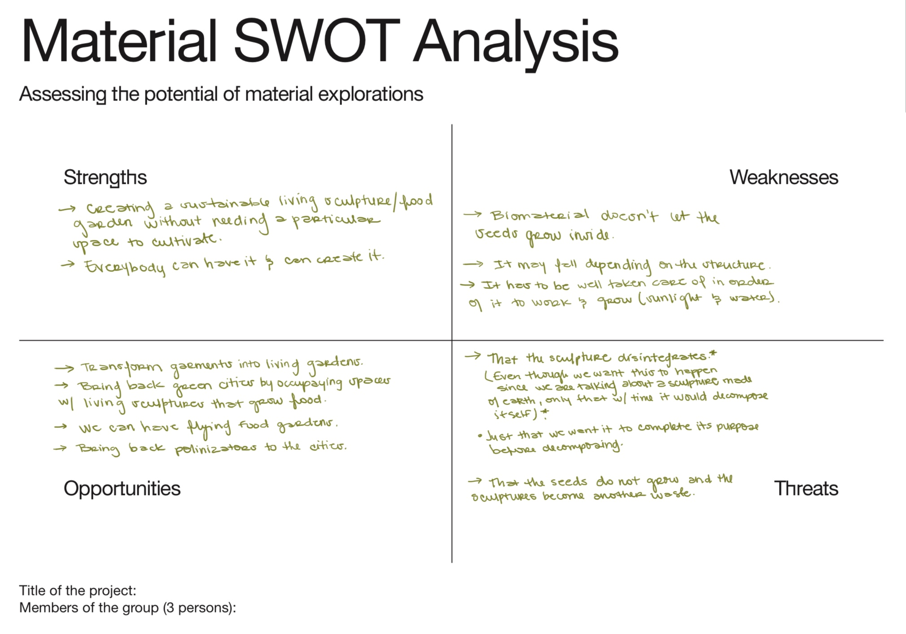
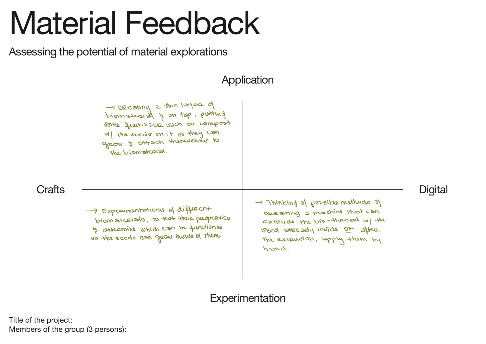
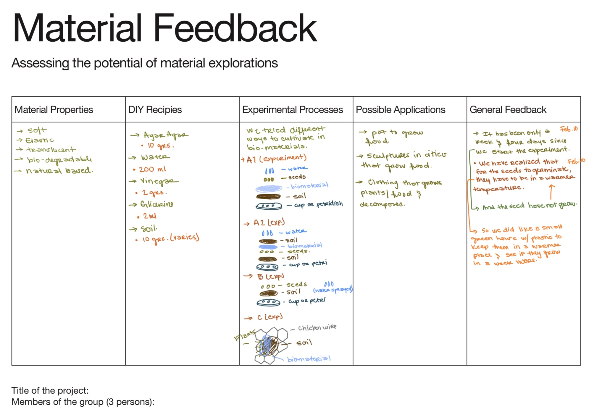
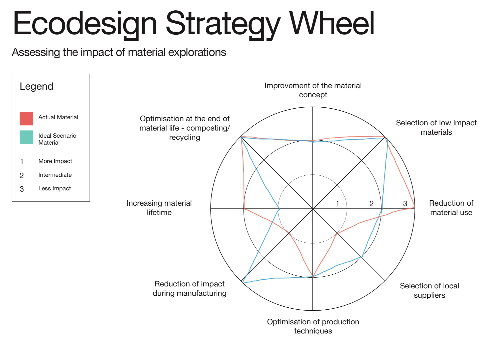
This research is based in Ruben's & I, as we joined for this workshop because we have an idea for intervention to create living sculptures that produce food. 
Our ideas for it, were this drawing that Ruben made in order for we to visualize them.

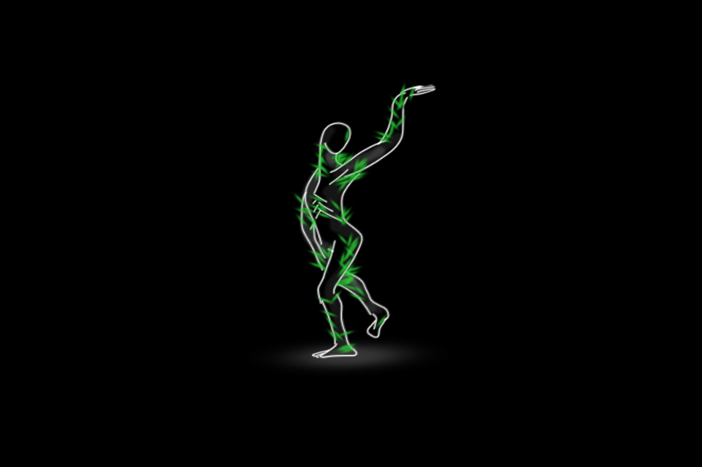
We digressed a bit in terms of creating materials themselves, to experiment with whether food can be germinated in biomaterials.

Before all experimenting and creating new materials, we created a plan that made sense to us in order for it to work and that the seeds germinate in our material. We developed 4 methods to experiment with biomaterial and see which of all could work.
As shown below, we experimented be putting the soil below the biomaterial (experiment A1), then the soil on top and seeds below of the biomaterial and again soil in experiment A2.
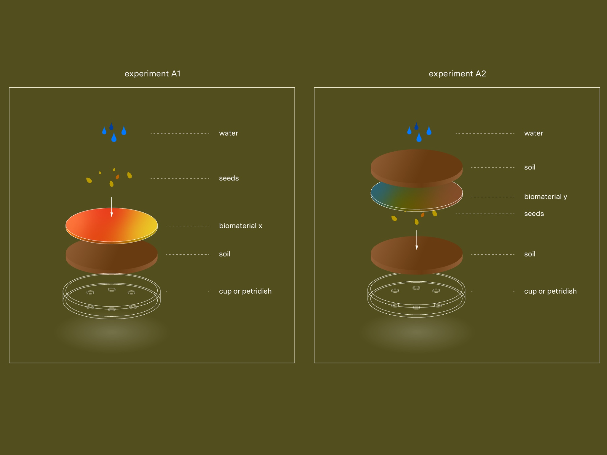
After it we decided to experiment with spreading water on the material seed, biomaterial, soil. And on experiment C, we tried to be more creative and instead of using a cup/ petridish we used chicken wire.
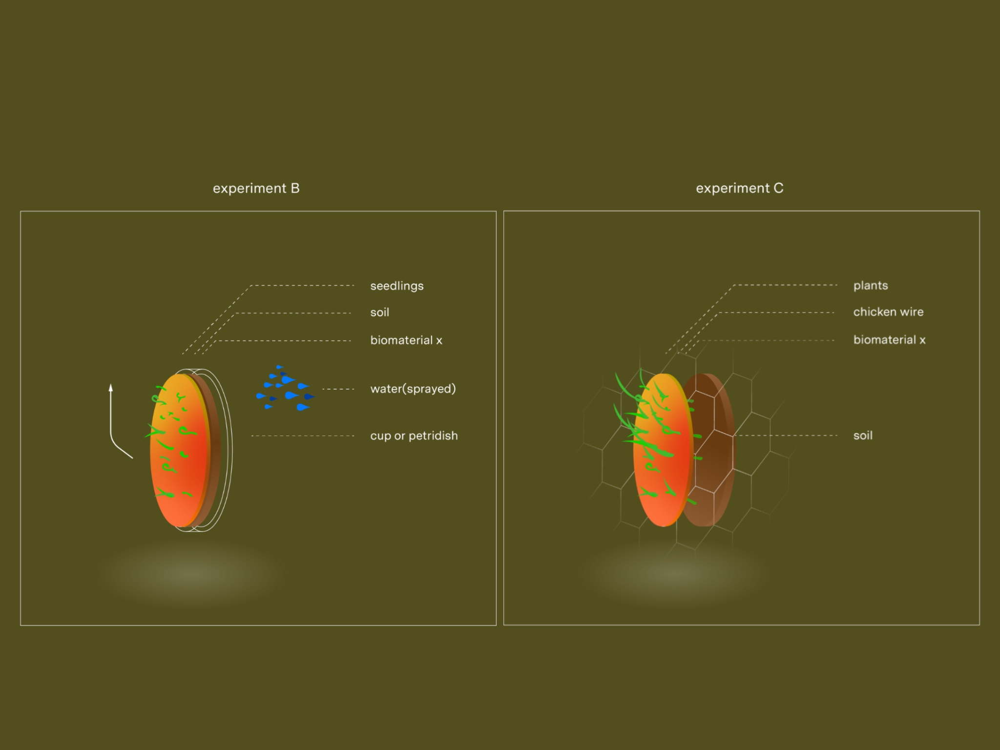

We used as recipe for our samples:

- Agar agar: 10 grs.

- Water: 200 ml.

- Glicerine: 2 ml.

- Vinegar: 2 grs.

- Soil: 10 grs. (varies)

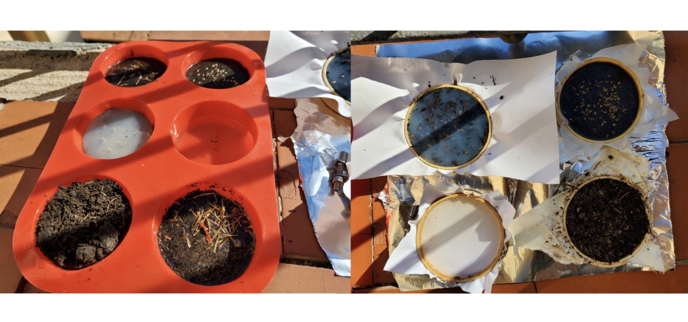
We did a bigger scale of our experiment and got out of the petri dishes to see if seeds grow on sculpture made out of soil (shown below). 
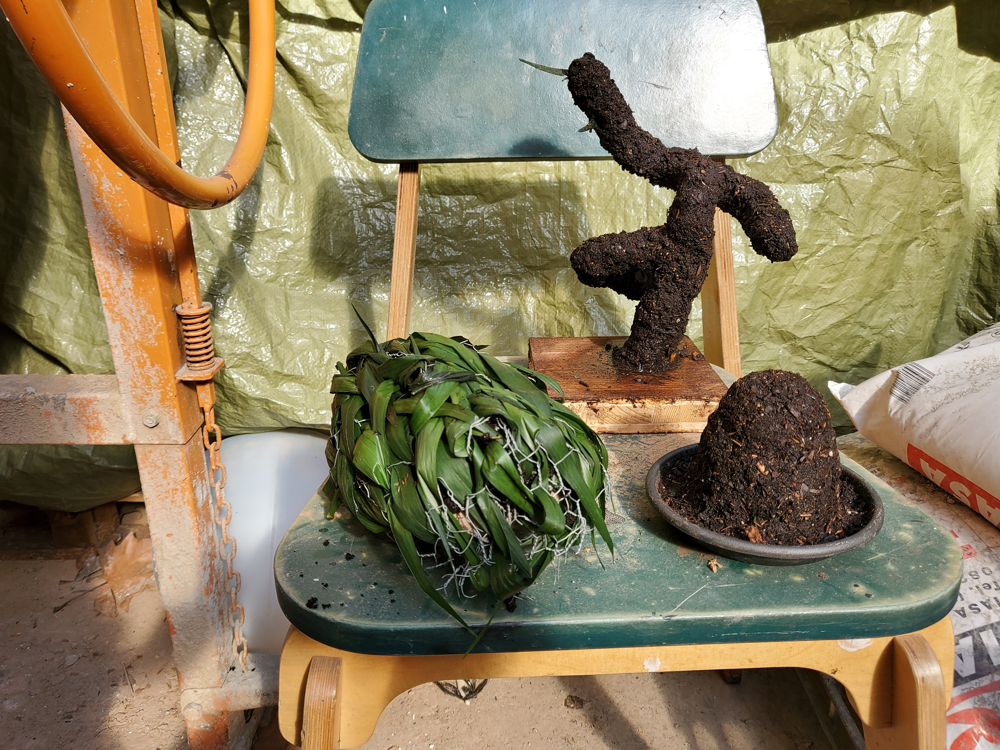

After a week and three days of watching if there would be any progress on germintation, we realized that the temperature in which the samples are, is not favorable for the seeds to germinate. So, we decided to create a type of "green house" for them, with plastic in order to create a better environment with a warmer temperature to see if they finally germinate.
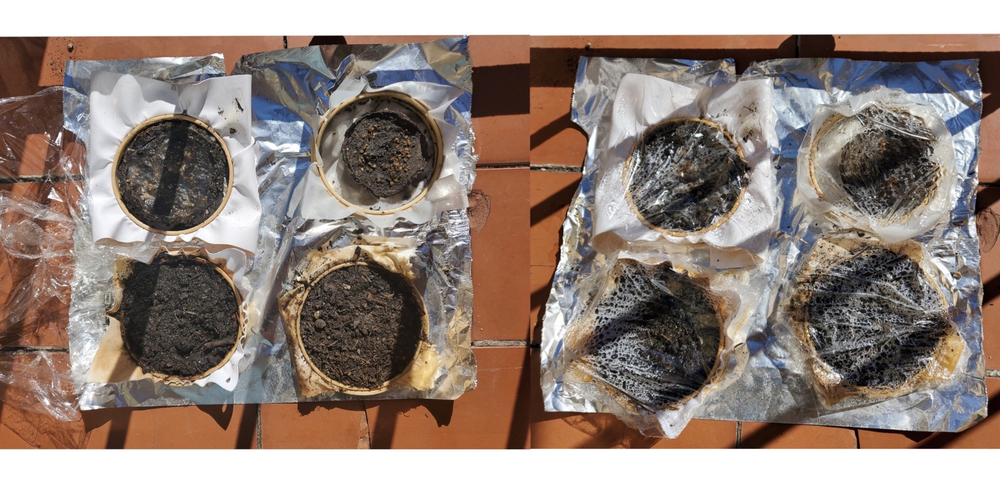

We hope they grow in this days and will put pictures of the progress.
:0

