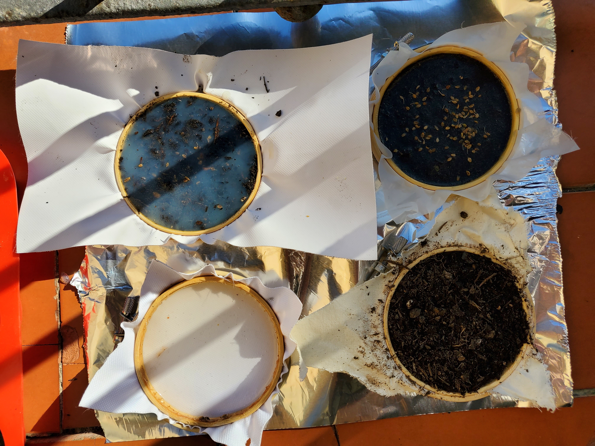
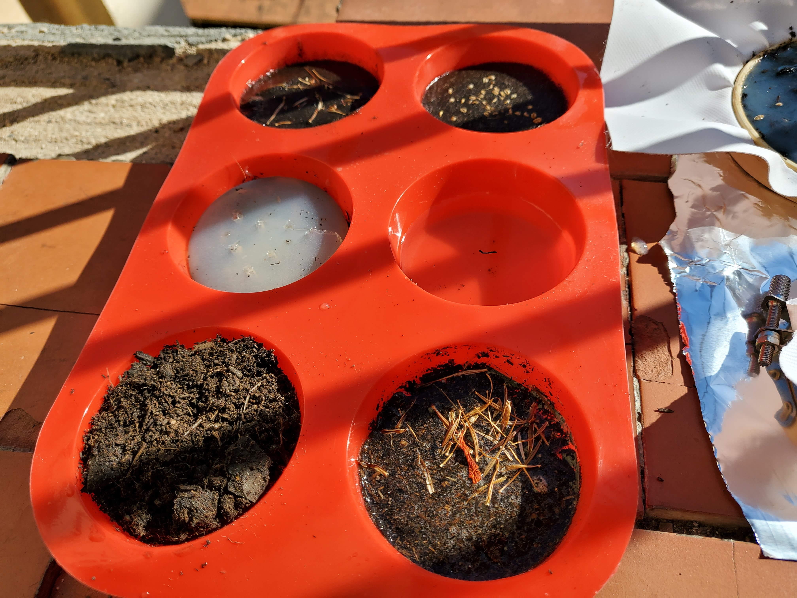

# Remixing Materials .01
## W/ Lara Campos

As exploratory material, I have decided to opt for creating bio-threads. For two years now, I have immersed myself in the world of research into materials based on organic waste. Bio-threads as such can be created with sodium alginate and calcium chloride, together with water. Pigments or other waste can be added to help its formation. I had never tried to create bio-threads before, since last December I participated in a workshop with an Argentine researcher named Carolina Etchevers. After this workshop, my interest in continuing to explore biothreads intensified and now I would like to continue exploring them.

Lara has a project called 'Be Grounded' that she did for Fabriacademy in 2019 where she knitted seeds into yarn filaments. That made me wonder if it would be possible to create natural-based threads that could grow food plants to be able to create street sculptures and occupy public spaces to be able to cultivate. Below, my first try of making bio-threads.

Here some of Lara's work:

And Carolina Etchevers work:

This are more experimentations w/ bio-threads but in this case as part of Lara Campos biomaterials class & group experimentation.

Part of how could I imagine this kind of sculptures is based on Robert Cannon's work 'Terraform' 2010. 

But, this sculptures are very sophisticated more than what I'm looking for. Actually, I wish I could try to create earthen structures where the bio-threads could get tangled up and plants could grow. I am not looking for these sculptures to fall into the aesthetic, on the contrary, I seek to produce accessible food for everyone with them.
We could use chicken wire or even go completely organic and use natural straws to form the structure of whatever we want our food sculpture to be. In addition to that, materials such as compost and soil, such as seeds, are necessary for this type of intervention to be carried out.
Also, instead of creating living sculptures, living garments could be created just like Lara did. But considering that these garments, after their useful life, are completely degradable since they will be created with biothreads and seeds.

Here the recipe:

- 12,5 grs. alginate

- 500 ml. water

- 30 ml. glycerin additives

- Calcium chloride solution: 30 grs. CaCl / 500 ml. H2O

## W/ Laura Freixas

Laura Freixas gave us her workshop dedicated to data collection regarding the materials/waste that we were going to create. Know its origin, its usefulness, the reason for its waste, its properties, the application that we would give it and the recipes that we made
It also introduced us to look for waste near our Iaac community, such as restaurants, bakeries, workshops, among many others that daily discard material.
We did our reserch w/ some documents Laura shared to us, for it to be more fast and have in mind the data that we recollected.

This research is based in Ruben's & I, as we joined for this workshop because we have an idea for intervention to create living sculptures that produce food. 
Our ideas for it, were this drawing that Ruben made in order for we to visualize them.

We digressed a bit in terms of creating materials themselves, to experiment with whether food can be germinated in biomaterials.

Before all experimenting and creating new materials, we created a plan that made sense to us in order for it to work and that the seeds germinate in our material. We developed 4 methods to experiment with biomaterial and see which of all could work.
As shown below, we experimented be putting the soil below the biomaterial (experiment A1), then the soil on top and seeds below of the biomaterial and again soil in experiment A2.

After it we decided to experiment with spreading water on the material seed, biomaterial, soil. And on experiment C, we tried to be more creative and instead of using a cup/ petridish we used chicken wire.

We used as recipe for our samples:
- Agar agar: 10 grs.
- Water: 200 ml.
- Glicerine: 2 ml.
- Vinegar: 2 grs.
- Soil: 10 grs. (varies)

We did a bigger scale of our experiment and got out of the petri dishes to see if seeds grow on sculpture made out of soil (shown below). 

After a week and three days of watching if there would be any progress on germintation, we realized that the temperature in which the samples are, is not favorable for the seeds to germinate. So, we decided to create a type of "green house" for them, with plastic in order to create a better environment with a warmer temperature to see if they finally germinate.

We hope they grow in this days and will put pictures of the progress.
:0

