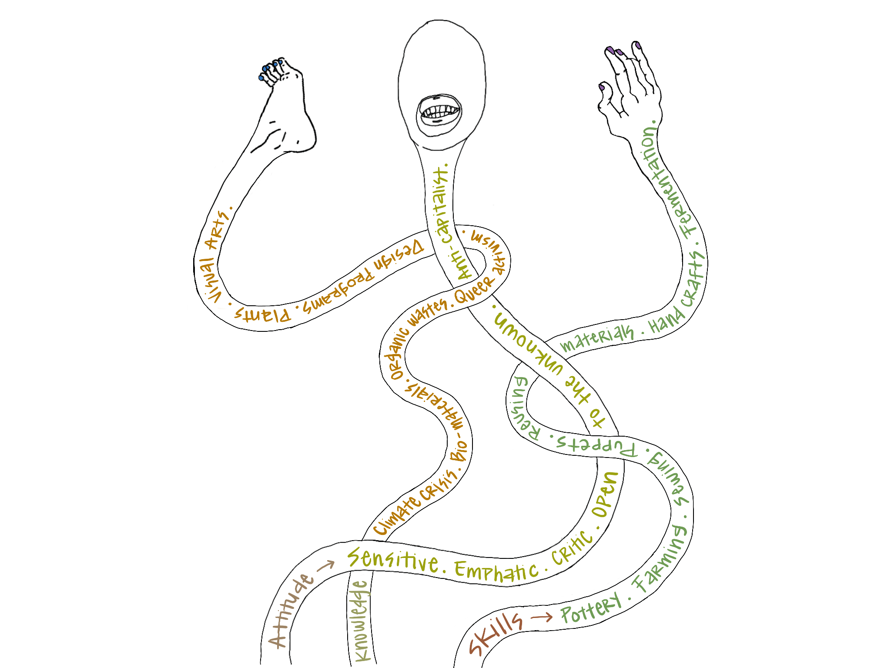
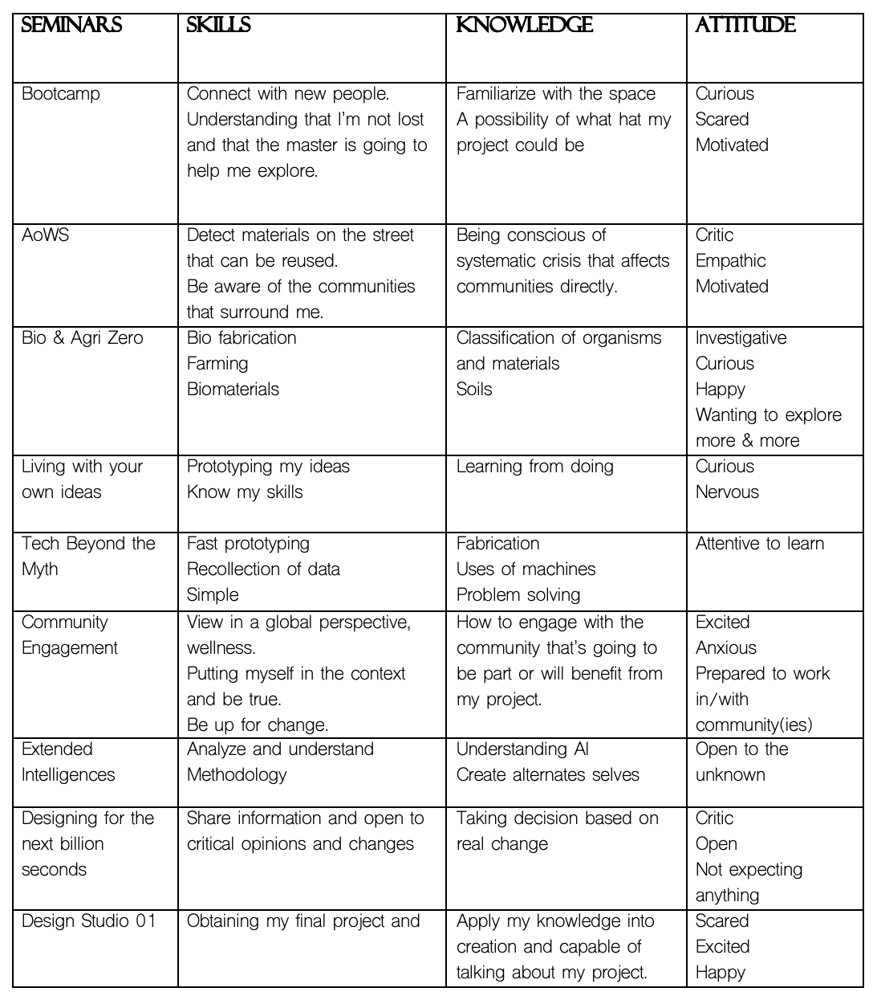

---
hide:
    - toc
---

# Bootcamp

<h1> What's my Fight? </h1>

When I applied to this master I had an idea of what I wanted to do, work with biomaterials & farming. When the Pre-Course started, I suddenly got lost in the sea of information they were sharing with me because I had no idea what they were talking about. Electronics, I have never in my life been in a class to do coding or work with rhino. I thought I was in the wrong place for a moment, so I gave myself the opportunity to calm down, at least try to understand what I was learning, and everything flowed even though I was still questioning myself why I was there. Once the bootcamp started, I was able to look back and ask myself the same question as to why I was there and what my interests were; my answer did not change, I continue with a view to working on biomaterials. The bootcamp opened the way to do a reflection of our interior, putting on paper what are the things that interest us and what are our attitudes in our present, emphasizing again and again that my work is in manual work / handcrafts. This being the portal of the use of reused materials, "garbage", clay, living organisms, among others. And I saw myself again, to feel safe to be in such a diverse space and without questioning why I was there as the only visual artist.

Above, a personal illustration of my skills, knowledges & attitudes.

Below, the chart of the skills, knowledge & attitudes I will like to have after each seminar.
