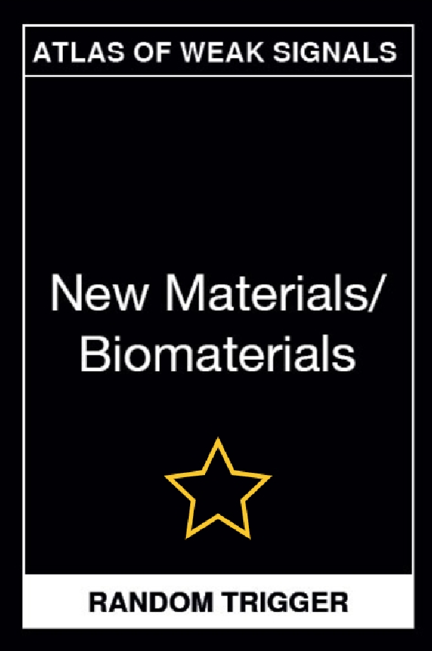
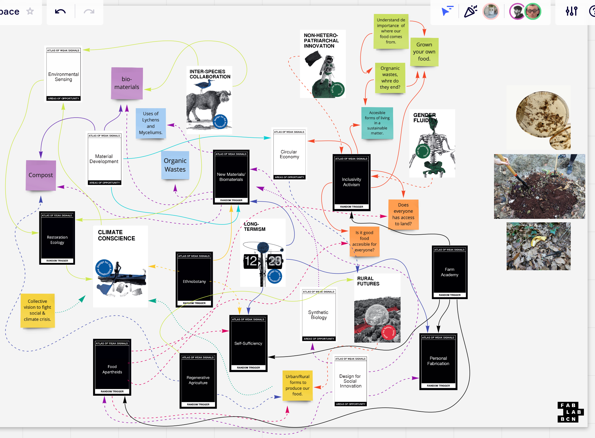
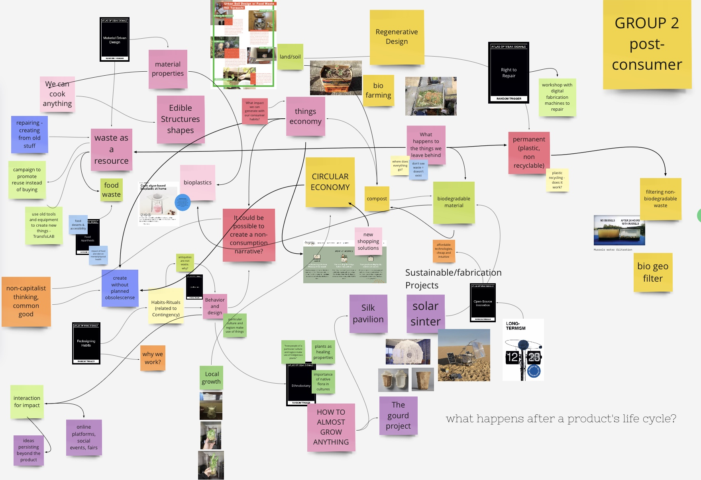
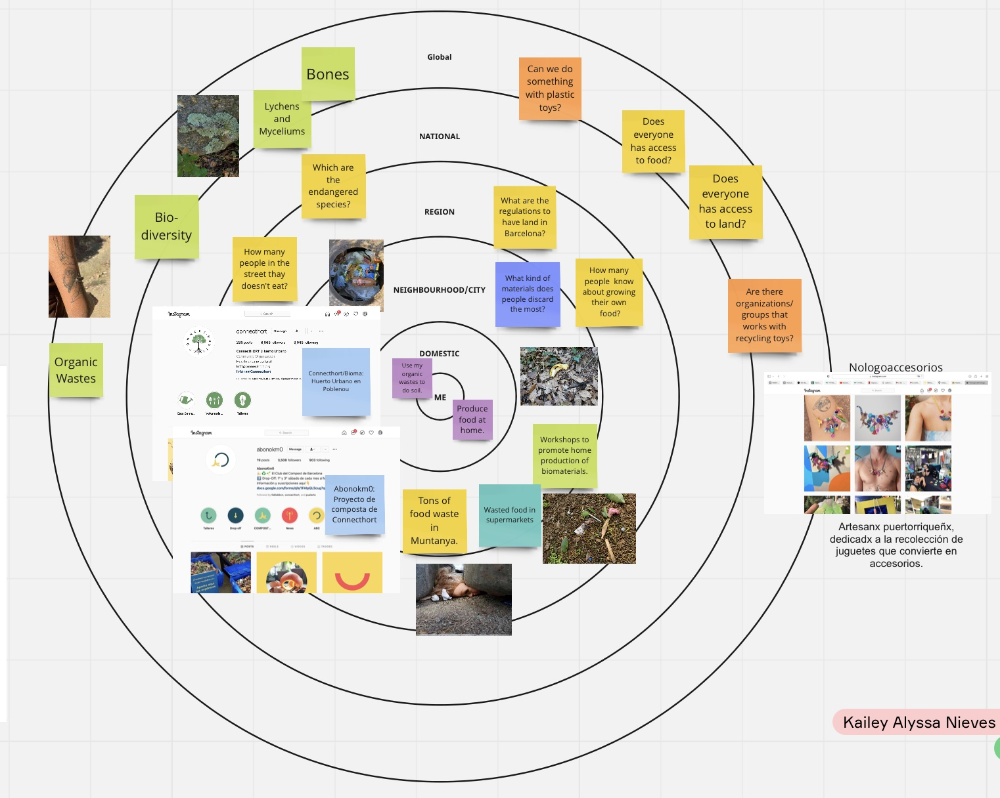

---
hide:
    - toc
---

# Atlas of Weak Signals

Kai’s Main Signals:

Bio-culture/materials

The fight that I presented a week ago was a bit of the access of information the lacks in my country for alternates forms of living sustainable and the use of organic wastes for the creation of new materials. I chose for the seminar of Aows, Bio-culture/materials being the first one as the main signal. I did because it collects everything that has to do with human behavior towards other living organisms, such as other animal, plants, etc. So why not understand these compartments from scratch to start with in what we really want to create an impact. I took that sign because I think it encompasses everything I would like to rethink from where I am now, about how to grow our own food to how to make our own materials out of wastes.

For me, this exercise was not as easy as it sounds. From what I could find through this diagram since we did a Hike and we had to go back to our home having this week signals on mind, was that in the neighborhood we were in and back to my home, there was a lot of food waste and a lot of plastic toys in the trash. What made me think with this first one, is the number of people who live without being able to eat and how we could do to stop wasting so much food or the alternative of growing our own food at home and not so much at home, it can also be rethinking our spaces of urban gardens as spaces for community food. In the second, which are the toys, I wondered a lot if there are organizations or companies that collect discarded toys to create other things or even new toys. So, I came home after observing these things in the different neighborhoods and I sat down at home to think about what I just said and what I could do about it. In my house we are 3 people, therefore we have a lot of organic waste that we collect and then dispose in the garbage cans, which does not make sense because we do not know what they do with that organic waste that people throw there. We do not know if they discard it in the same place where they dispose of regular garbage. Therefore, I began to wonder if the best alternative was to separate the uncooked waste from the cooked waste, so that we could create a compost system and create our own land to grow at home. 

It was very interesting to share the things that I had thought or seen with people who have interests like mine and who can also contribute to things that I had not contemplated or the same vice versa, they not having contemplated it. The group was "called" or rather it went towards the subject of the post-consumer and one of the topics that resonated a lot was food, either as waste or literally as a source of food, and what could be an impact as regenerative design.

By this week work I would like to be able to contact people who give or do permaculture and / or botany. in addition to people who work with growing food for communities and who have a waste system either for themselves and / or for the community. And I would like to experiment with lichens and mycelium or any sort of organism that can give me the tools to build a sustainable source of food. Maybe building a biomaterial that gives food if you discard it. Or maybe finding a way to create or know a fungi or bacteria that eats plastic. I just know that I want to keep experimenting with different kind of biomaterials and growing food.
The new skill that I would like to add to my personal development plan is knowing bacteria and fungi and plants as essentials organisms in our system. How to identify them and knowing for what they can be used for and creating biomaterials with them. I would also like to add the fact of being able to contribute and / or direct people who do not know how to cultivate at home and the possibilities they have. Finally, I would like to add as a skill in my personal plan, to be capable enough to create a project that integrates my interests such as biomaterials and agriculture.

