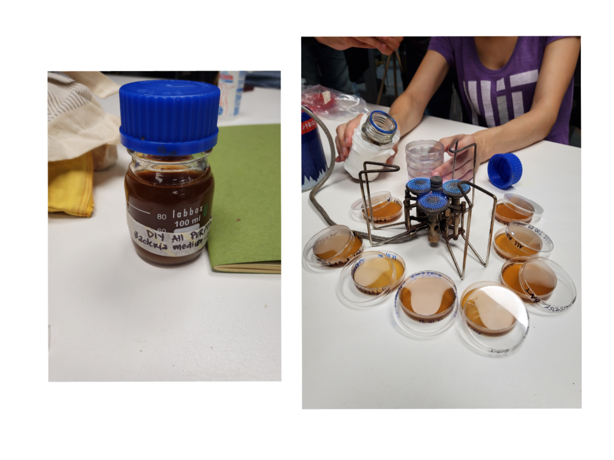
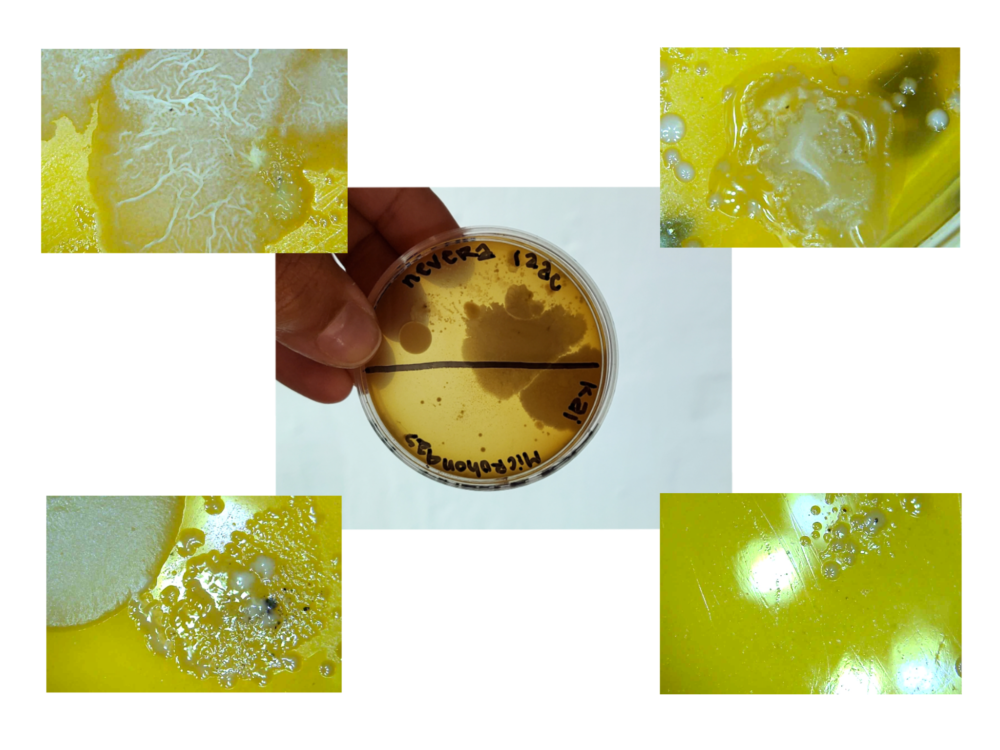
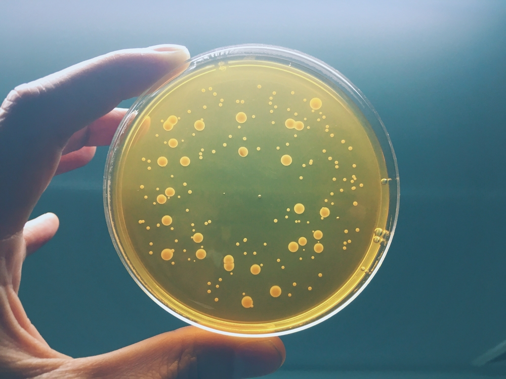
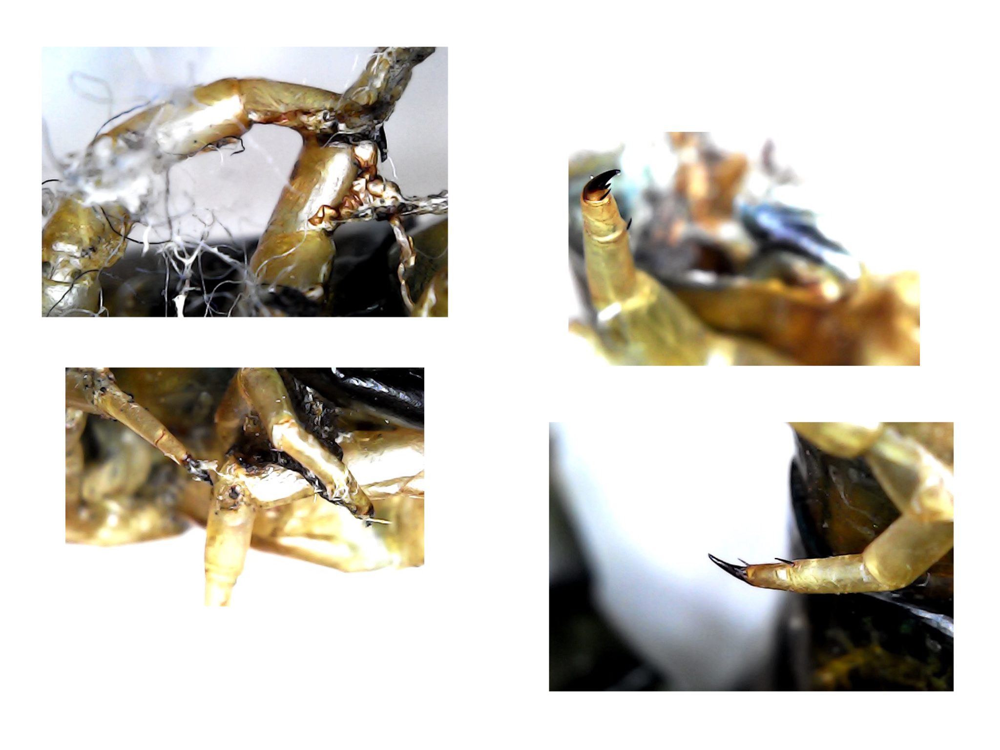

# Bio-Zero

This week was very interesting by the way that we entered different branches in general science. Exciting to be able to grow micro-organisms from things we found.

iGEM Experiment¶
Purpose¶
To create a bioengineer microbes on a strip where you put a drop of tattoo ink and could tell you if the ink is contaminated or if it’s ok to be used.
How¶
Non-selective Agar Medium strip to detect Aerobic Mesophilic Bacteria 

I search online about how to detect  aerobic mesophilic bacteria and got to how to test bacterias in cosmetics. What they perform is a test by diluting in a neutralized solution, at the same time the product is subjected to an enrichment culture to facilitate growth of some bacteria that may be represented in a low number. Dilutions of the product in neutralizing solution and enrichment culture is plate on solid non-selective agar medium (Non-selective media are intended to cultivate microorganisms in order to multiply them. It is a simple culture medium without a selection agent that will allow the growth of microorganisms in an undifferentiated way. )and incubated for 72 hours at 32.5ºC.
https://www.ncbi.nlm.nih.gov/pmc/articles/PMC6961714/ 

“The most common growth media nutrient broths (liquid nutrient medium) or LB medium (Lysogeny Broth) are liquid. These are often mixed with agar and poured into Petri dishes to solidify. These agar plates provide a solid medium on which microbes may be cultured. They remain solid, as very few bacteria are able to decompose agar. Many microbes can also be grown in liquid cultures comprised of liquid nutrient media without agar”.
https://courses.lumenlearning.com/boundless-microbiology/chapter/culturing-bacteria/ 
Growing spirulina and kombucha were the two things that most motivated and captivated me. It is not my first time working with kombucha, as I have become scoby sane. but, to return to the concept of cultivating it with others, I really liked it. Furthermore, spirulina had never grown before and neither did I know that it was used as food.
After this, the exercise of looking for things outside to see them under a microscope was fun. I carried a hundred foot dead that I had killed the day before and seeing its textures and colors was fascinating.
