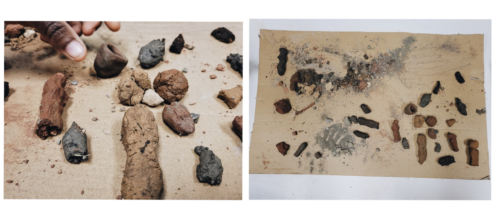
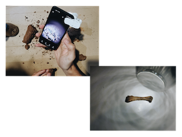

# Agri-Zero

## Why do we want to change agriculture?

I think it is well necessary to rethink and reevaluate ourselves so that we can effectively change the agricultural processes that exist today. In addition to that, I believe in food sovereignty from the lowest and accessible to all people. I have my conflicts with the fact that we live in a capitalist system that forces us to buy food and housing in order to live.
We should decapitalize food so everyone has a plate of food on their tables. and I think the best way to do this is to take the empty spaces in our cities and create urban gardens.I understand that there is a need to leave agricultural work in the field because the city cannot sustain it, but that is the point of doing it, that the communities get involved in these processes.

If occupying spaces is not an option, another would be to transplant plants that provide food in random places and conceptualize a map of the city with the locations of these plants, so that people have a resource and a place to go to look for food.
With all this said, the possibilities of growing food are many; from aeroponics to having a plot of land and making a community garden.
