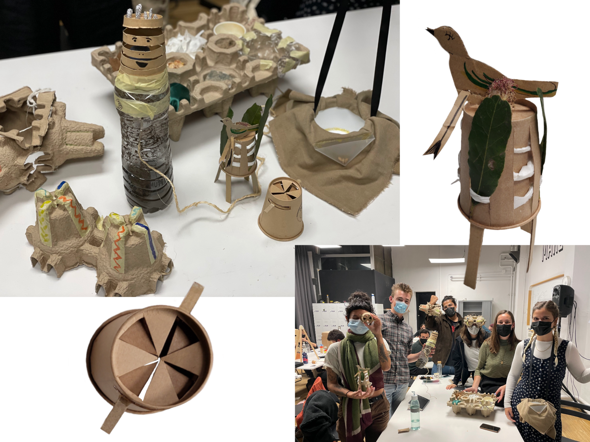

 
# Living with your own ideas

A drawing of myself in 3 seconds & the meaning of my magical machine:

My machine:

Solar Punk Group:

Group Reflection:

The interventions in the group revolve around various discourses one makes, in search for identity of oneself. There is a shared common interest in finding a balance between the internal and the external parts of life. This balance is explored by different ways of engagement tied together by a common aspect of positionality. 

<video width="320" height="240" controls>
  <source src= "../../images/Don't get lost - Kai Nieves [new].mp4" type="video/mp4">
  