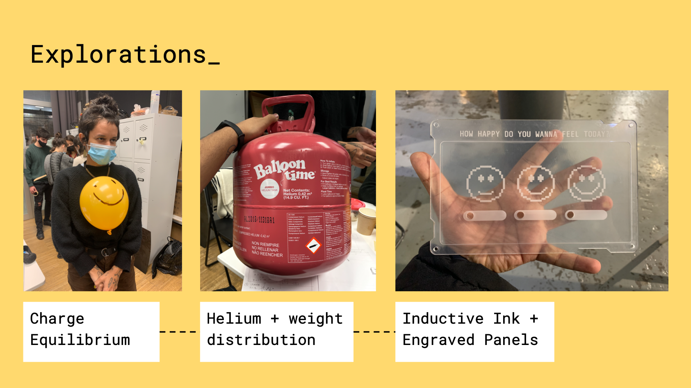

# The Almost Useless Machine

HOW HAPPY DO YOU WANNA FEEL TODAY?_ :)

FABRICATION_

[https://youtu.be/wdrpc9YuWf8](https://youtu.be/wdrpc9YuWf8)

WHAT IS IT SUPPOSED 2 DO?_

Create an almost useless machine based on recycled materials from other machines, in particular those that we had dismantled the previous week, mega entertaining. We used a fan and a tv screen to make the machine, and build a a three-floor platform with cardboard that was created with Rhino and the cut in the Laser Machine. Although, I think the exercise was still a bit stressful because we only had two days to create the machine and make it work. I can comment that perhaps it could have been a better distribution of the groups, so that there was a more adequate balance in terms of the abilities of each person and all the groups. But nothing, I think that despite everything, the exercise was great. Our working group decided to make a machine around the word alone / loneliness. A machine to detect how happy  do you wanna feel that day. As for the other machines created, I think the concepts were great and they created very fun things. It was very diverse in the way we chose the pieces and decided to reuse them for our artifact. 

EXPLORATIONS_

STORYBOARD_

<video src= "../../images/loner.mp4" width="520" height="440" controls></video>

[https://docs.google.com/presentation/d/1R_QlpASGupockWAJxV_IFKaKJ-OMxydYArBRfEmzGw0/edit?usp=sharing](https://docs.google.com/presentation/d/1R_QlpASGupockWAJxV_IFKaKJ-OMxydYArBRfEmzGw0/edit?usp=sharing)

:)_