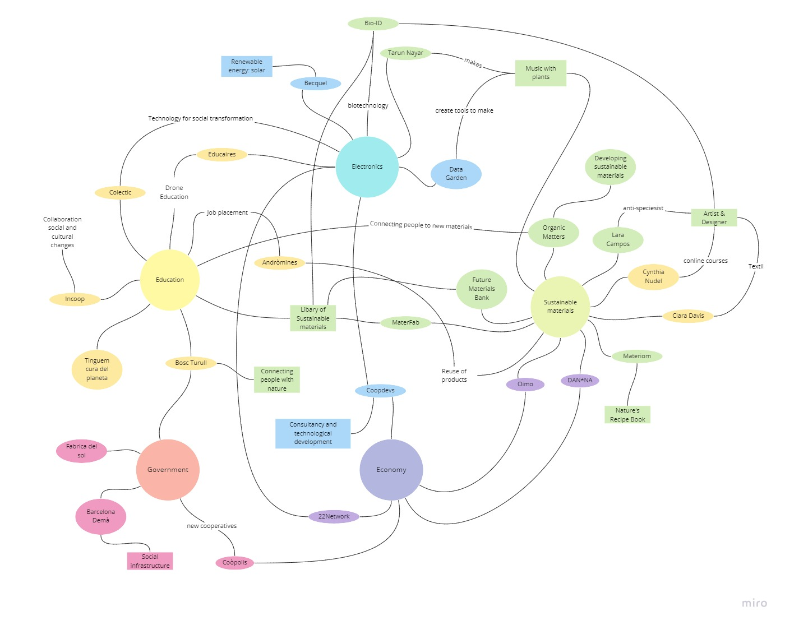
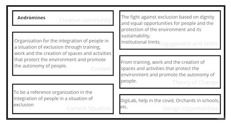

# Community Engagement

My observation of this week was 'how to reach the community that we selected to do our intervention'. Anna and I, got together to build a music box with biomaterials for kids. The plan is to do a simple workshop of how to do bioplastics by and for kids in a school of very low resources, inmigrants, gypsies, etc. where we believe that it is extremely important to educate not only because the system makes it impossible for these communities to overcome themselves and in society. But also, because we believe that to change the system, education has to come from below and horizontally, making even the most discriminated/excluded communities part of the process, because they are important too. We believe that the future is in the hands of children and the type of education they receive regarding how to improve our existence on the planet, if there is a solution.

## Local Ecosystem Mapping

This is the local ecosystem map regarding things that affects the community we are trying to engage. in the top, obviously is the government who control the economy. Those things together controls the education and type of education that takes you or not to understand what is technology and sustainable materials in our system and possible futures.

## Intervention Challenge Diagram

In the intervention diagram we decided to put different individuals and/or organizations that are working with biomaterials and/or with electronics, and some of our past projects regarding this two themes.

## Creative Communities

Two important organizations for our intervention that integrate people in a situation of exclusion through training, work and the creation of spaces that protects the environment and promote the autonomy of people.

## How do we get there?

How do we get there?
From our past investigation and project we can do an educative intervention from our knowledge to kids or even adults about production systems for electronics with sustainable materials. And that will take us to the future of achieving systems with sustainable electronics.

Link to our Miro Board:
[https://miro.com/app/board/uXjVOf3XDVg=/](https://miro.com/app/board/uXjVOf3XDVg=/)
