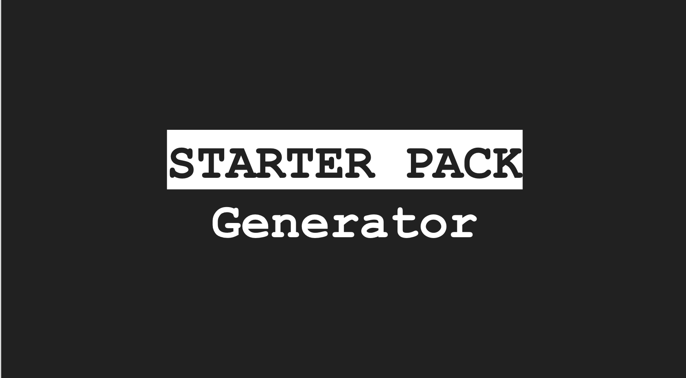
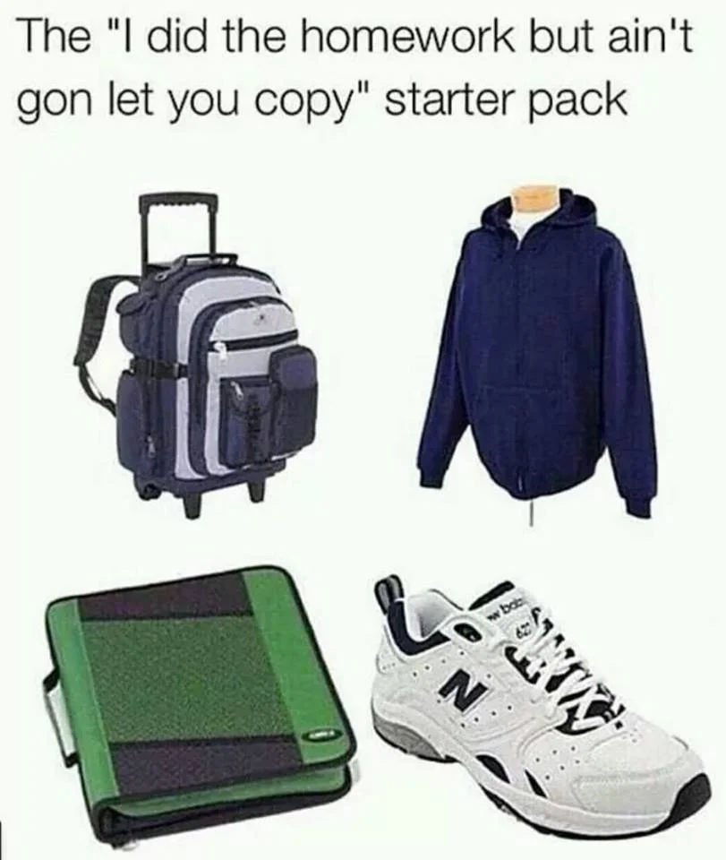
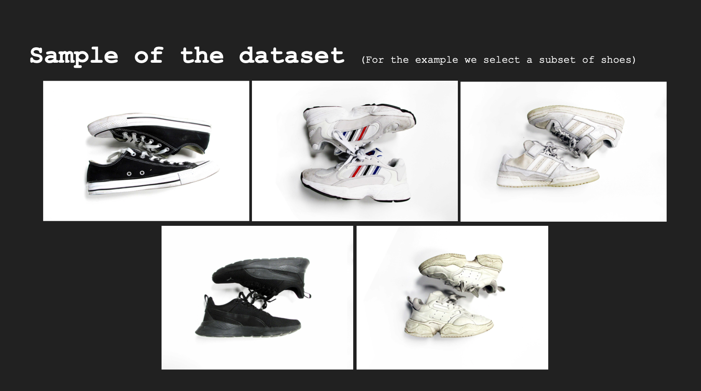
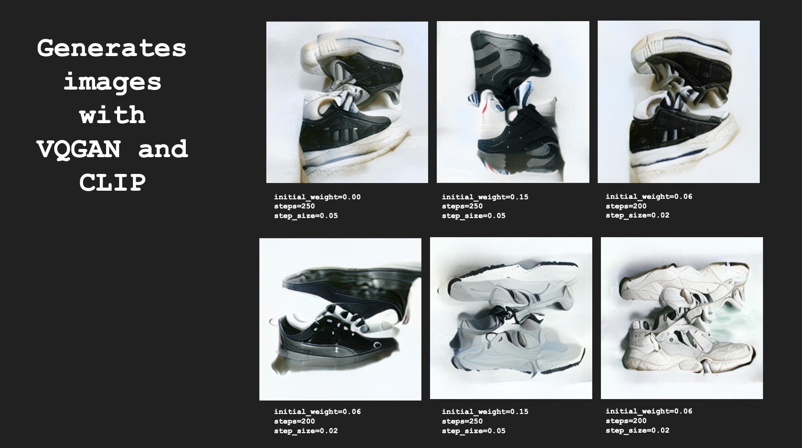
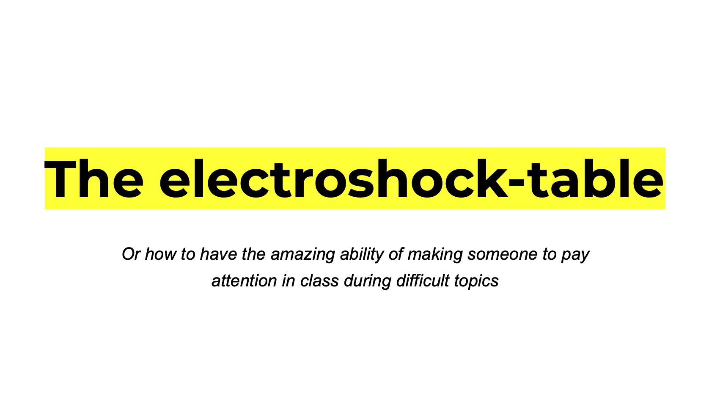
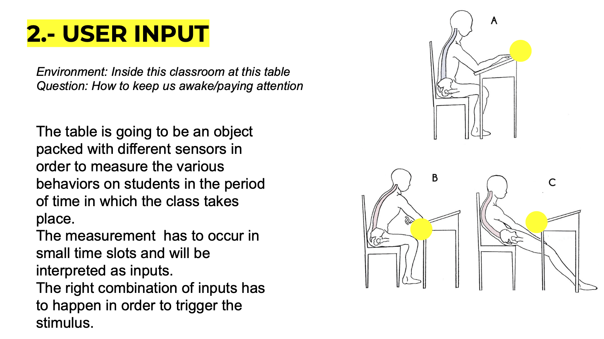
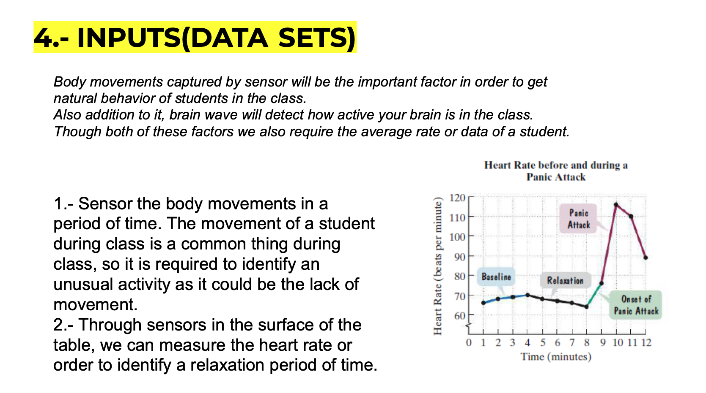

# Extended Intelligences

## Starter Pack Generator 

IDEA:
- Using AI, trained with a catalog dataset, we want to generate outputs as a index of an artificial person.
- By the analysis of the dataset we be able to generate new objects as shoes, books, coats, bags… that together set up a new superficial identity.

Background - inspiration:

Personality generation: Character generation for fictional characters.
[https://www.character-generator.org.uk/personality/](https://www.character-generator.org.uk/personality/)

Creating the dataset:

Catalog of different objects. It's necessary to have one dataset with subsets per object.

Collecting data:

- Clothes 
- Shoes
- Coats
- T-shirts
- Pants
- Food
- Books
- Hairstyle
- Makeup
- Furniture
- Art

Sample of Data Set with our shoes:

Generated Images:

REFLECTIONS:

- The image generation from a database allow us to create new visual and personal identities that scape our creative process and allow us a new form of expression ourselves.

- This kind of generations can aid in a creative process in order to leave behind human bias, leading to a more spontaneous results.

- The creation of new relationships between the merging or the generation of new images can challenge our understanding of our visual world and the way we perceived it through our vision, we can understand from this, that context is fundamental in the construction of our personal reality.What we think it is real, it is not, what we think it couldn't exist, it could.

- This kind of process is a source of “Almost infinite” resources for creativity.  

Link to our presentation:
[https://docs.google.com/presentation/d/1-4Eb5VKIGf3kqSfr40TxhLEWaPGLjzwR7zazM_jlasY/edit#slide=id.p](https://docs.google.com/presentation/d/1-4Eb5VKIGf3kqSfr40TxhLEWaPGLjzwR7zazM_jlasY/edit#slide=id.p0)

## Electroshock Table

- Environment: Inside this classroom at this table
- Question: How to keep us awake/paying attention

Often, a class the topics have a high level of comprehension for students they tend to be distracted or bored.

From this issue/problem, we think it is needed a table which could be able to identify each student behaviors in order to produce an output that stimulate her/his/they attention on class.

