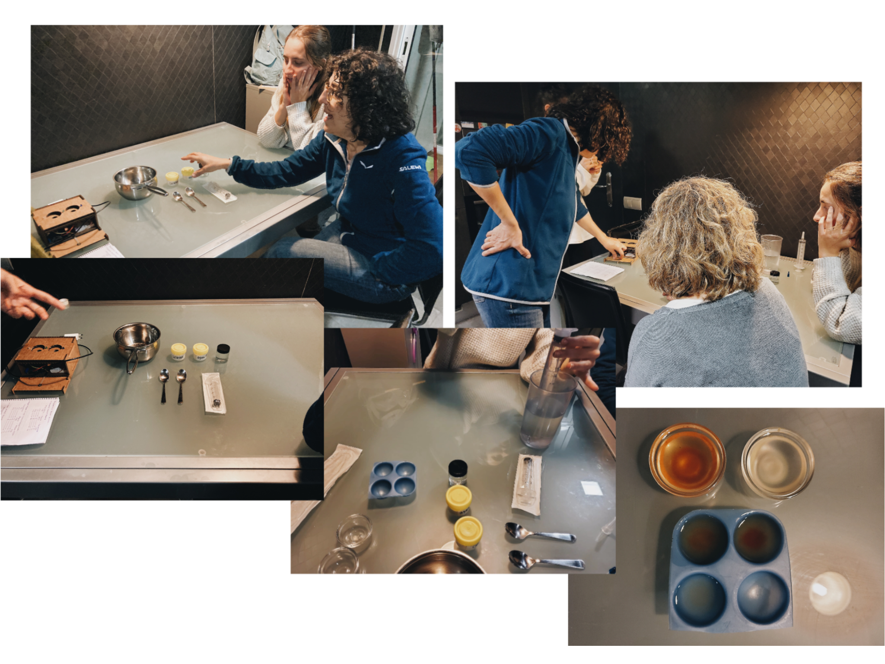

# 01 Design Dialogue/Intervention

In the design studio we were entrusted to meet with people from our master whose interests are similar to what I would like to work on. So, we got together in a group that was called "Solar Punk". At the beginning we had the same interest of exploration, but at some point, when the design studio asked for a group intervention, we had different things in mind that each one of us wanted to do.

Link to our Solar Punk Group:
[https://miro.com/app/board/o9J_lrJ1Z7M=/](https://miro.com/app/board/o9J_lrJ1Z7M=/)

So instead of finding a middle ground, we decided to split the group and join with other persons that wanted to do an intervention similar to our interests. That is it when I partner with Anna. We had this thing in mind of doing toys for kids and our target community was working with kids, giving them a workshop of how to do your own bioplastics and use them after, as toys (in this case regarding electronics). At first we were thinking of possible toys that could create energy and that bioplastics could be integrated. At last, we decided to make a music box for kids. 

Bioplastics being the material used to change the sound because of its properties. In the middle time of doing this, we wanted to do a workshop of bioplastics with the kids because it is really important that if we want to change our living manners and our existence in this planet one way is by educating. The community of kids that we selected was a school of very low resources, inmigrants, gypsies, etc. where we believe that it is extremely important make them part of this kinds of themes, because the system makes it impossible for these communities to overcome themselves and in society and because they do not have the same information as us.

This were our steps on doing the intervention:

And Preparation:

We got to talk about our plans for the intervention with Mariana and she suggested to go a step back in the workshop with the kids, because we don't have knowledge of how to reach kids attention. So we decided to do the workshop with at least three teachers that work with kids around five to seven years, and have their oponion if it is a good workshop to do and if kids will be interested in.
This were the materials used in the workshop with the teachers.

- Gelatine
- Glicerol
- Agar Agar
- Water
- Two bowls
- Measure cup
- Syringe
- Pot

## Video of our intervention:
<video src= "../../images/Biothesizer_KaiAnna.mp4" width="600" height="520" controls></video>
:')